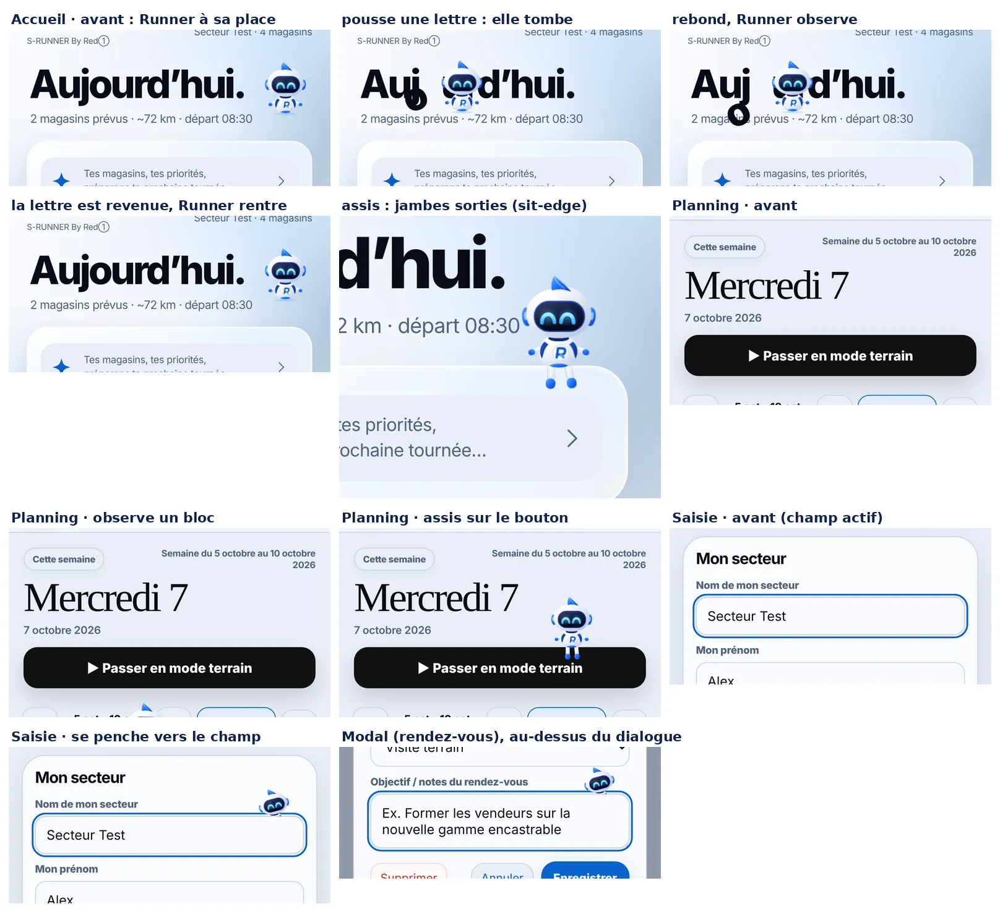

# Runner Ambient / Playground — V1

`runner-ambient.js` (`StoreRunnerAmbient`) fait « habiter » Runner dans toute l'application : de petites scènes finies, jouées près d'un élément de l'écran réellement affiché, toutes les **8 à 12 s de calme**. C'est une couche **100 % de présentation** : elle ne lit ni n'écrit `state`, le stockage, un moteur de planning, un rapport ou la mémoire de Runner, ne lit jamais le texte saisi (seulement « un champ a le focus »), ne clique rien, ne prend aucun focus et n'intercepte aucun geste.

Build `20261006-r61-runner-ambient-276`, version visible **276 inchangée** (lot de présentation, pas de nouvelle version produit). Branche `claude/runner-ambient-playground-v1`, **PR Draft, ne pas fusionner** : trois décisions humaines sont demandées plus bas (budget de démarrage, `sw.js`, réglage utilisateur).

## Pourquoi un contrat de plus

Jusqu'ici Runner n'existait que **dans le flux** de ses cinq hôtes (Assistant, Planning, Accueil, premier lancement, remarque du rapport) : « jamais flottant, nulle part ailleurs » (`RUNNER_VISUAL_SYSTEM.md`). Quitter l'Accueil faisait « perdre » Runner. Ce chantier étend explicitement le contrat : une **sixième surface**, la couche ambiante, a le droit d'être flottante — et d'elle seule. Les cinq hôtes ne changent pas : leur Runner reste dans leur flux, posé et décidé par eux. `tests/runner-visual-v269.test.cjs` épingle maintenant six propriétaires (l'ajout de `runner-ambient.js` y est explicite).

## Architecture retenue

```
runner-visual.js   Runner (dessin, états, gestes)  ← + posture « assise » (jambes), geste « tilt », instance « détachée »
runner-ambient.js  couche ambiante                  ← calque, contextes, garde-fous, 6 scènes, cadence
```

* **Point d'intégration global : un calque fixe unique `#srAmbientLayer`**, enfant de `<body>`, créé au premier besoin. Il est **sous la barre basse** (`z-index:100` < 105), plein écran, `overflow:hidden`, `pointer-events:none!important` sur lui et tous ses descendants, `aria-hidden`. Aucun écran n'a besoin de le connaître : la couche lit l'écran actif (`.panel.active`), le champ actif (`document.activeElement`) et les recouvrements, et se pose elle-même. Pas de bricolage écran par écran.
* **Promotion en couche supérieure du navigateur** : le compte rendu 6P, le rendez-vous et la fiche magasin sont des `<dialog>` modaux, hors d'atteinte de tout `z-index`. Pour un champ de l'un de ces trois dialogues seulement, le calque est promu par l'API Popover (`popover="manual"` + `showPopover()`), puis rendu (`hidePopover()`, attribut retiré) à la fin de la scène. Sans Popover (avant iOS 17) : aucune scène dans un modal. Dans une feuille fixe non modale (fiche magasin), le calque prend `z-index` de la feuille + 1.
* **Un acteur détaché** : `Runner.mount(scène, { size, decorative:true, detached:true })`. Une instance détachée n'entre pas dans le registre de `runner-visual.js` : elle n'est jamais comptée par `Runner.mounted()` et jamais le Runner « principal » de l'API globale. Créée au début d'une scène, détruite à la fin : **aucun nœud ne reste** entre deux scènes.
* **Un seul Runner visible** : quand un hôte (Accueil, carte du Planning) est visible, neutre, au repos et de taille `sm`, il est **prêté** : l'acteur sort exactement de sa place (échange sans à-coup) et y revient ; pendant ce temps `html[data-sr-ambient]` masque la figure des hôtes par `visibility:hidden` (la mise en page n'est jamais touchée). Sans hôte, l'acteur entre par le bord de l'écran le plus proche.
* **Animations** : Web Animations bornées (`transform`/`opacity` seulement), toutes finies, annulées ensemble. Une seule temporisation de **cadence** en attente, plus un **chien de garde** pendant une scène ; **aucun `setInterval`**, aucune boucle `requestAnimationFrame`, aucun polling.

## Contextes supportés (3)

| Signal | Condition | Scènes |
| --- | --- | --- |
| `HOME_IDLE` → `home` | `#homePanel` actif, rien ne recouvre l'écran | `letter-push`, `letter-double`, `sit-edge`, `peek-behind` |
| `PLANNING_VIEWING` → `planning` | `#planPanel` actif | `sit-edge`, `observe-card`, `peek-behind` |
| `FORM_TYPING` → `form` | un champ éligible a le focus (texte, recherche, date, nombre, zone de texte), dans un écran ou un dialogue autorisé | `lean-field` |

Les autres écrans (Magasins, Historique…) **dorment** en V1 : 3 contextes maximum. Un champ actif prime sur l'écran. Le clavier ouvert sans champ actif ne joue rien. `REPORT_READING` (lecture d'un compte rendu) n'est pas un contexte V1 ; il s'ajouterait dans le tableau `CONTEXTS`.

## Les 6 micro-animations V1

| Scène | Contexte | Ce que l'on voit | Durée |
| --- | --- | --- | --- |
| `letter-push` | Accueil | Runner sort de sa place, vient à droite d'une lettre du titre (« Aujourd’hui. »), la pousse d'un coup d'épaule ; la lettre bascule, tombe, rebondit ; Runner l'observe ; elle revient en arc à sa place ; Runner rentre | ≈ 6 s |
| `letter-double` | Accueil | Idem avec deux lettres, l'une après l'autre ; Runner recule d'un pas et hoche la tête quand elles reviennent | ≈ 6 s |
| `sit-edge` | Accueil, Planning | Runner descend sur le rebord haut d'un bloc, **s'assoit (jambes sorties, balancées)**, regarde, se relève (jambes rentrées) et repart | ≈ 5,7 s |
| `peek-behind` | Accueil, Planning | Runner file derrière le rebord d'un bloc, disparaît, ressort la tête, regarde, penche la tête, repart | ≈ 5,6 s |
| `observe-card` | Planning | Runner flotte près d'un bloc, penche la tête vers lui, le « scanne » d'un côté puis de l'autre | ≈ 4,4 s |
| `lean-field` | Saisie | Runner (75 %) émerge de **derrière le rebord haut du champ**, tête penchée vers lui, regard baissé ; il ne recouvre jamais le champ | ≈ 4,5 s |

Les lettres : la lettre réelle est masquée par un surlignage CSS (`::highlight`, **aucune modification du DOM**) et remplacée par un clone typographiquement identique, au pixel près, qui tombe puis revient. Sans API Highlight (avant iOS 17.2), les scènes de lettres ne se jouent pas ; l'Accueil retombe sur `sit-edge` et `peek-behind`.

## Captures (Android 390 px, rendu réel)



Ligne 1 : l'Accueil avant (Runner à sa place) puis `letter-push` : la lettre est poussée, tombe, rebondit. Ligne 2 : la lettre est revenue, Runner a regagné sa place ; `sit-edge` : Runner **assis, jambes sorties** ; le Planning avant. Ligne 3 : `observe-card` et `sit-edge` dans le Planning, le champ actif avant. Ligne 4 : `lean-field`, puis le même geste dans le dialogue modal de rendez-vous (couche supérieure). Les captures figent une scène : le rythme se juge à l'écran (vidéo ou téléphone).

## Jambes : rentrées / sorties

Runner a deux postures de **présentation** : `floating` (défaut, **pour tous les hôtes**) et `seated`.

* `floating` : `.rnLegs{opacity:0;visibility:hidden}`, jambes repliées (`scaleY(.06)`), halo bleu au sol visible : la silhouette compacte flottante de l'identité Runner.
* `seated` : `.rnLegs{opacity:1;visibility:visible}`, jambes dépliées sous le corps (membre nacré à liseré fin, botte bleue), halo au sol éteint, balancement **fini** (3 passages) sur demande (`data-legs="swing"`). Quand Runner repart, `floating` repli les jambes avant le décollage.
* API : `instance.setPosture('floating' | 'seated', { swing })`, `instance.getPosture()`. Rien d'autre ne les montre ; une posture inconnue est refusée. Le dessin, l'identité (visière, crête, emblème « R ») et les quatre états sont inchangés.

## Cadence

Après chaque scène (ou chaque refus), la couche arme **une** temporisation de **8 à 12 s** (aléa uniforme, moyenne ≈ 10 s, écart-type ≈ 1,15 s : jamais un métronome). Elle compte le **calme entre deux scènes** : deux déclenchements sont donc séparés de 8 à 12 s *plus* la durée d'une scène, jamais d'un chevauchement. Un seul nombre à changer (`GAP_MIN`/`GAP_MAX`) si le rythme doit passer à « de début à début ». Un champ qui prend le focus arme une scène en **1,2 à 2,2 s** (au plus une toutes les 25 s). Les scènes continuent quand l'utilisateur touche, défile ou frappe ; seuls un changement d'écran, la perte du focus (scène de saisie), un recouvrement ou l'ancre qui disparaît la referment (fondu de 180 ms).

## Garde-fous (la couche s'efface)

| Situation | Raison rendue par `play()` |
| --- | --- |
| mouvement réduit demandé au système (aussi à chaud) | `reduced-motion` — aucun calque, aucune temporisation |
| onglet masqué, `pagehide` | `hidden` — annulé immédiatement |
| personnalité **Discret** (V273, `controller().idle()===false`) | `quiet-personality` |
| ligne vocale de l'Accueil visible, point du jour ouvert (V273/V276) | `home-voice` — la voix prime |
| un hôte non neutre (alerte, analyse, succès) ou en mouvement | `host-state` / `host-busy` |
| assistant, menu Plus, premier lancement, feuille magasin, dialogue non autorisé, bannière de mise à jour, démarrage | `overlay`, `first-run`, `sheet`, `dialog`, `update`, `boot` |
| clavier ouvert sans champ, écran non supporté | `no-context` |
| aucun rebord libre | `no-spot` |

**Ne jamais cacher du texte** : chaque position candidate est validée par un test d'occupation (grille 4 × 5 sur l'empreinte de l'acteur, `elementFromPoint`, boîte réelle du texte via `Range`) : plus de 20 % d'occupation = position refusée, et si rien ne convient, **pas de scène**. Un rebord n'est valable que s'il est réellement rendu à cet endroit (un `<details>` replié garde des coordonnées virtuelles). L'acteur ne reste jamais sous la barre basse ni sous un en-tête collant, et suit son ancre pendant le défilement (même dans un conteneur interne) ou le clavier.

## Coût mesuré (Chromium, Pixel 7 émulé 390 px)

| Mesure | Résultat |
| --- | --- |
| Démarrage d'une scène (garde-fous, hôte, recherche d'un rebord libre, calque) | 3 à 15 ms à vitesse normale ; **≤ 60 ms sous CPU ralenti ×4** (Accueil ≤ 38 ms, Planning ≤ 60 ms), une fois toutes les ~15 s ; recherche bornée à 50 évaluations (60 ms en simple filet) |
| Pendant une scène | Web Animations `transform`/`opacity` sur le compositeur ; un `getBoundingClientRect` par événement de défilement pendant la scène seulement |
| Entre deux scènes | une temporisation en attente, aucun nœud, aucun écouteur de défilement ou de taille |
| Mutations du DOM de l'Accueil et du Planning (hors Runners) pendant toutes les scènes | **0** |
| Données, `state`, stockage | strictement identiques avant/après (comparés dans le spec) |

## Ce qu'Ambient ne fait jamais

Aucune donnée (ni `state`, ni stockage, ni IndexedDB), aucune lecture de valeur de champ, aucun focus pris ou rendu, aucun clic ni toucher capté, aucune écoute d'interaction (clic, toucher, clavier, saisie), aucun son, aucune notification, aucun texte parlé (la voix de Runner reste à V273/V276), aucun HTML dynamique, aucun réseau. Écoutes de la couche : visibilité, `pagehide`/`pageshow`, `focusin`/`focusout` (sans lire la saisie), préférence de mouvement, et, **le temps d'une scène seulement**, `scroll` et `resize`.

## Fichiers modifiés

`runner-ambient.js` (nouveau), `runner-visual.js` (jambes, posture, `tilt`, `detached`), `index.html` (chargement, build), `sw.js` (shell + build), `version.json`, `manifest.webmanifest` (build), `tools/run-browser-tests.mjs` (Ambient éteint par défaut dans la suite E2E, comme l'onboarding ; `?e2eAmbient=on` le rallume), `tests/runner-ambient-v1.test.cjs`, `tests/runner-ambient-v1-browser.spec.cjs`, `tests/runner-visual-v269.test.cjs` (contrat étendu), `tests/fixtures/cleanup-baseline-r20.json` et `tests/priority-campaign-removal-browser.spec.cjs` (budget 79), `.github/workflows/reliability-checks.yml`, `AGENTS.md`, `RUNNER_VISUAL_SYSTEM.md`, `ARCHITECTURE_CLEANUP_STATUS.md`.

## Décisions humaines demandées

1. **Budget de démarrage 78 → 79** (`runner-ambient.js` est le 79ᵉ script). Une alternative sans nouveau script (charger Ambient à la demande depuis un propriétaire existant) a été écartée : elle exige quand même une entrée dans le shell de `sw.js`, un chargement différé fragile hors ligne et masque le coût réel.
2. **`sw.js` au-delà de `BUILD_REV`** : une ligne de précache (`"./runner-ambient.js"`, shell obligatoire). La règle « Qui fusionne » demande un accord humain explicite avant fusion.
3. **Réglage utilisateur** : V1 n'ajoute aucune préférence (ni donnée, ni écran). Le seul interrupteur est la personnalité **Discret** déjà existante (Plus → Apparence → Personnalité). Un interrupteur dédié se ferait dans `navigation-controller.js` (feuille Apparence), pas ici.
