# Premier lancement guidé par Runner — V271

Runner guide le **tout premier démarrage** de Store Runner : présentation, secteur, point de départ, génération des 3 premières semaines, entrée dans l'Accueil. Runner reste de la **présentation pure** : chaque étape appelle le propriétaire existant de l'action et Runner traduit son résultat réel en état visuel. Cahier des charges : issue #503.

> Statut : **PR Draft** — validation visuelle attendue avant toute fusion. Ce document est le contrat ; la section « Preuves » rend compte de ce qui a été exécuté et de ce qui reste ouvert.

## Décision d'architecture

Un premier lancement existe déjà dans `navigation-controller.js` (depuis V234) : quatre écrans de formulaire, le marqueur `store-runner-onboarding-v1` du moteur durable, le nettoyage de la graine de démonstration et la protection des utilisateurs existants (`hasRealUserData`). V271 **remplace ces quatre écrans par cinq étapes guidées** dans le même propriétaire. Rien n'est ajouté à côté.

| Sujet | Décision |
| --- | --- |
| Propriétaire | `navigation-controller.js`, déjà propriétaire du premier lancement. Aucun nouveau module. |
| Scripts de démarrage | **77, inchangé.** Aucune ressource runtime ajoutée. |
| `sw.js` | `BUILD_REV` seulement. Aucune entrée de cache ajoutée : tout ce que le guide utilise est déjà dans le shell obligatoire. |
| Runner | `runner-visual.js` tel quel, variante `sheet`, taille `md` (comme l'Assistant), mouvement V270 `moveTo(..., { entrance: 'peek' })` pour la présentation. Aucun second Runner, aucun clone SVG. |
| Schéma `state` | **Inchangé.** Le marqueur de complétion est la préférence UI existante (`store-runner-onboarding-v1`, moteur durable, hors `state`, hors sauvegarde JSON). Champs facultatifs ajoutés au marqueur : `startSkipped`, `generated`. |
| Accueil | `home-refresh-v2.js` ne joue plus l'entrée de Runner V270 *sous* le guide ; elle est jouée à la fermeture du guide (événement `store-runner:first-run-closed`). Sans guide, comportement strictement inchangé. |

## Parcours (cinq étapes)

Une action principale par étape, un bouton Retour quand il a un sens, « Plus tard » ferme le guide (marqueur `dismissed`, comme avant).

| # | Étape | Runner | Action principale | Propriétaire appelé | Fait réel lu |
| --- | --- | --- | --- | --- | --- |
| 1 | Présentation | neutre — « Je suis Runner, ton copilote terrain. » | Commencer | — | — |
| 2 | Ton secteur | neutre, puis succès dès qu'un magasin existe | Ajouter mes magasins · Importer mes données | `StoreRunnerStoreAdd.open` (`store-add-v261.js`) · écran Données (`importPanel`) | nombre de magasins réels de `state.stores` |
| 3 | Ton point de départ | neutre · analyse pendant la recherche de position · alerte si refus/indisponible · succès | Utiliser ma position · Saisir une adresse · Passer cette étape | `StoreRunnerProfile.resolvePlanningOrigin` / `applyPlanningOrigin` (`profile-controller.js`) · `openDepartureSettings()` | `storeRunnerHasValidBase()`, résultat de l'API de position |
| 4 | Ton planning | neutre — « Ton secteur est prêt. Générons tes 3 prochaines semaines. » · analyse · alerte | Générer mes 3 semaines | `storeRunnerGenerateThreeWeeks()` (`planning-generation-controller.js`) | résultat `{ ok, error, result.totalVisits, result.uniqueStores }` du propriétaire |
| 5 | Fin | succès — « C'est prêt. Je t'accompagnerai dans le Planning, l'Assistant et tes magasins. » | Ouvrir mon accueil | `goTab('homePanel')` | — |

Règles :

- **La position GPS n'est jamais demandée au lancement.** Elle n'est demandée qu'au tap sur « Utiliser ma position » (étape 3) ou, comme avant V271, au clic explicite « Générer mes 3 semaines » (le propriétaire de la génération relit une position fraîche ; l'étape 4 le dit avant le clic quand aucun départ n'est enregistré). Aucune lecture `navigator.geolocation` dans `navigation-controller.js` : tout passe par `StoreRunnerProfile`.
- **La génération reste une action explicite.** Le guide appelle `storeRunnerGenerateThreeWeeks()` au tap, une seule fois à la fois, et affiche ce que le propriétaire a renvoyé. Il ne choisit aucun magasin, ne simule rien, n'écrit aucun planning.
- **Succès = fait du propriétaire.** « C'est prêt » n'apparaît que si le propriétaire répond `ok` et annonce au moins une visite. Un échec montre son message tel quel (état `alert`), avec « Réessayer » ; l'échec n'écrit aucun planning (vérifié : plan, plage et archive identiques avant et après).
- **Aucune promesse non fournie.** Pas de « planning optimisé », « meilleur trajet » ou « optimal » : le test les interdit dans le guide. Les chiffres affichés (magasins, visites planifiées) viennent de l'état ou du propriétaire.
- **Départ par adresse.** Le guide ouvre l'écran existant du point de départ (`openDepartureSettings()`), attend `store-runner:profile-saved` et reprend à l'étape suivante. Il n'écrit pas le profil lui-même. Si l'utilisateur revient sur l'Accueil sans avoir enregistré, le guide reprend à l'étape du départ.
- **Import.** Le guide ouvre l'écran Données existant (marqueur `importing`). Une restauration (`store-runner:data-restored`) termine le guide (utilisateur existant). Des magasins arrivés par un autre chemin d'import sont détectés au prochain rendu de l'Accueil (`store-runner:home-rendered`, une seule fois, seulement tant que le guide attend un import) : le guide reprend alors à l'étape suivante. Si l'utilisateur revient sur l'Accueil sans rien importer, le guide reprend à l'étape du secteur.

## Reprise : l'étape se déduit de l'état réel

Le marqueur n'est qu'un indice (`step`, `startSkipped`, `generated`). À chaque ouverture, l'étape est recalculée depuis ce qui existe vraiment :

| État réel | Étape |
| --- | --- |
| aucun magasin réel, présentation pas encore dépassée | 1 |
| aucun magasin réel, présentation dépassée | 2 |
| des magasins, aucun point de départ valide, étape pas passée | 3 |
| des magasins, point de départ valide ou étape passée, planning pas généré par le guide | 4 |
| planning généré par le guide (`generated`), fin pas encore validée | 5 |

Un marqueur écrit par l'ancien parcours (étapes 0 à 3) est lu de la même façon : seule la déduction compte.

### Utilisateurs existants protégés

- Marqueur `complete` ou `dismissed` : le guide ne revient **jamais** (vider ou régénérer son planning ne le rouvre pas).
- Sans marqueur : toute donnée réelle (`hasRealUserData` : magasins non démo, visites, notes, plan, rendez-vous, profil renseigné, réglages modifiés…) écrit `complete` (`existing-user`) en silence.
- Marqueur `in-progress` mais activité qui dépasse l'installation (visites, rendez-vous, notes, opportunités, données métier) : `complete` (`existing-user`) en silence. Un secteur + départ + planning déjà faits ailleurs que dans le guide : `complete` (`setup-complete`) en silence.
- Restauration de sauvegarde : `complete` (`restored-data`), comme avant.

## Mouvement et accessibilité

- Présentation : Runner sort de derrière le logo (`entrance: 'peek'`, 1 180 ms, V270) **une seule fois par document**. Retour à la présentation, nouveau rendu, changement d'étape : placement direct, aucun rejeu.
- `prefers-reduced-motion` : aucun mouvement (Runner et transitions du guide). Placement direct, états toujours distincts par les yeux, les gestes et le texte.
- Runner n'est jamais flottant, jamais focusable, `pointer-events:none` ; il est monté dans le flux de la carte du guide. Il est détruit à la fermeture.
- Boîte de dialogue : titre d'étape en `h2`, focus placé dessus à chaque **changement** d'étape (pas aux mises à jour d'une même étape), voix de Runner annoncée à chaque changement d'étape ou d'état (sa bulle visuelle est masquée aux lecteurs d'écran : elle EST le contenu du guide), sauf l'alerte, dont la note `role="alert"` porte le message du propriétaire, tabulation bouclée dans la carte, cibles tactiles ≥ 44 px (boutons principaux et secondaires ≥ 48 px), aucun champ de saisie (donc pas de zoom automatique iOS).
- Petits écrans : la carte est ancrée en bas sur téléphone et ses actions restent collées à son bord inférieur ; si le contenu dépasse (iPhone SE 320 px, texte agrandi), il défile **sous** elles, l'action principale ne sort jamais de l'écran. En écran court (`max-height:480px` : paysage, fenêtre partagée), la carte se resserre et les actions passent côte à côte. `touch-action:manipulation` : un double toucher rapide ne zoome pas la page. Aucun `:has()` (absent avant iOS 15.4).
- Aucun `setTimeout`, `setInterval` ni écouteur permanent ajouté : événements métier existants seulement, écoutés tant que le guide est en cours. **Un seul observer, borné** : pendant un renvoi vers l'écran Données ou point de départ, il regarde la classe `active` de `#homePanel` (un seul élément) pour reprendre le guide quand l'utilisateur revient sur l'Accueil sans avoir terminé (bouton Retour d'Android, onglet Accueil). Il est créé au renvoi, déconnecté à la reprise et à la fin du guide, jamais créé pour un utilisateur installé ; un rendu de l'Accueil en arrière-plan ne reprend rien.

## Ce que le guide ne fait pas

Il n'écrit ni `state` ni planning, n'ajoute aucun registre, ne remplace aucune fonction globale, ne choisit ni ne simule aucune visite, n'appelle aucun moteur autrement que par le point d'entrée public du propriétaire, ne demande pas la position au démarrage, ne touche pas `/v2/`.

Hors périmètre (issue #503) : couleur/apparence de Runner (V272), personnalité (V273), nouvelles règles de planning, refonte Home/Planning/Assistant, nouveau moteur d'import.

## Preuves

### Captures (rendu réel de l'application, pas des maquettes)

Parcours complet à 390 px (Pixel 7 émulé, vrai dialogue d'ajout V261 avec 12 magasins Darty, position simulée) :

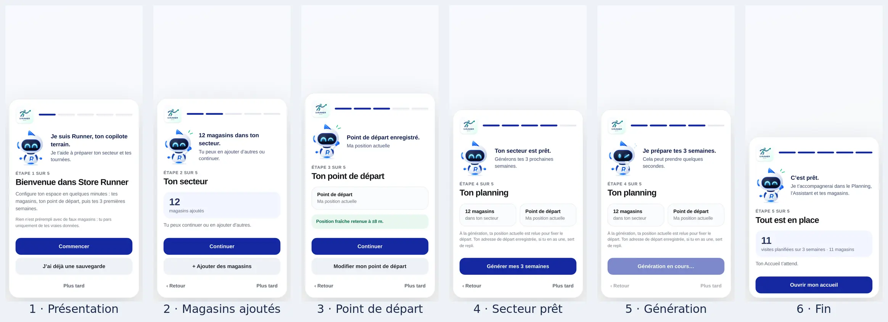

Les quatre écrans demandés par l'issue, en grand (Android 390 px) :

| Présentation | Secteur prêt | Génération | Fin |
| --- | --- | --- | --- |
| 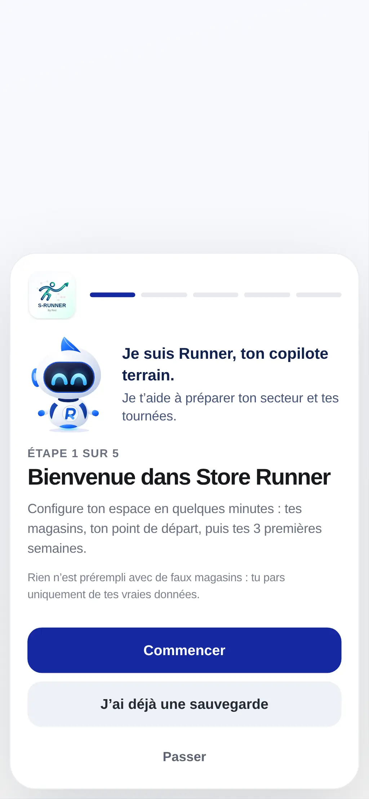 | 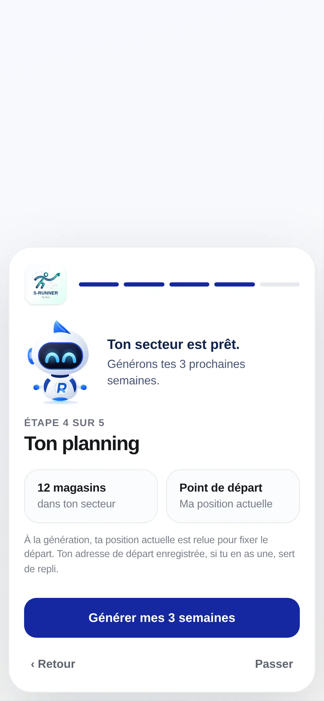 | 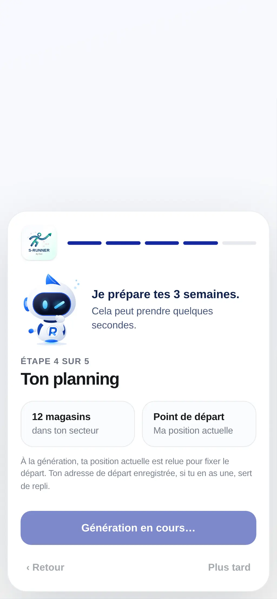 |  |

Cas d'erreur contrôlés — le message du propriétaire est montré tel quel, Runner passe en alerte (silencieuse : la note `role="alert"` porte le message) :

| Position refusée | Génération refusée |
| --- | --- |
| 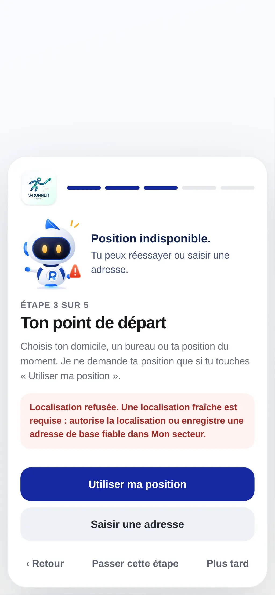 | 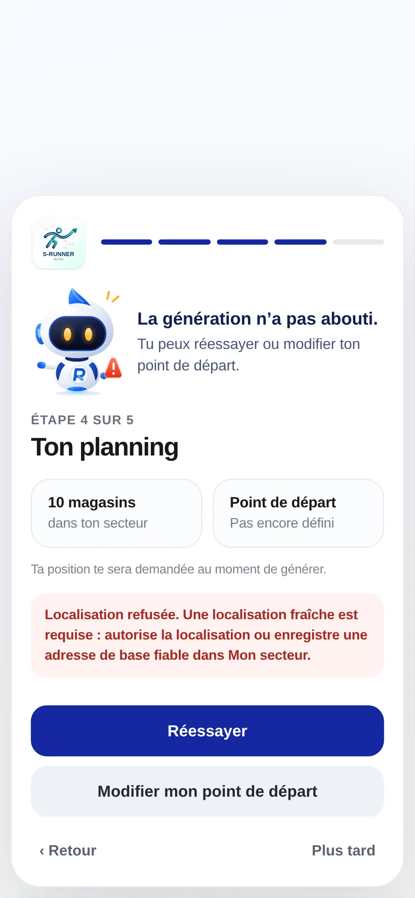 |

Autres étapes, 390 px : [secteur vide](tests/fixtures/first-run-v271-android390-2-secteur-vide.webp) · [magasins ajoutés](tests/fixtures/first-run-v271-android390-3-secteur-pret.webp) · [départ](tests/fixtures/first-run-v271-android390-4-depart.webp) · [départ enregistré](tests/fixtures/first-run-v271-android390-5-depart-enregistre.webp) · [Accueil après le guide](tests/fixtures/first-run-v271-android390-9-accueil.webp).

Galaxy S8, 360 px :

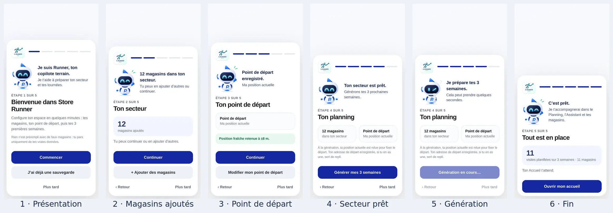

iPhone 14 (émulation Chromium, zones sûres simulées : 47 px en haut, 34 px en bas — voir « Ce qui reste ouvert ») :

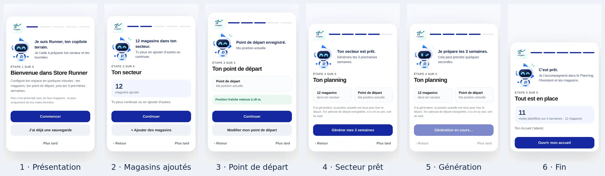

Petits écrans, paysage, texte agrandi — de haut en bas : iPhone SE 320×568, iPhone 14 en paysage (750×340), Galaxy Note II 360×640 avec le texte à 140 % ; l'action principale reste toujours visible :

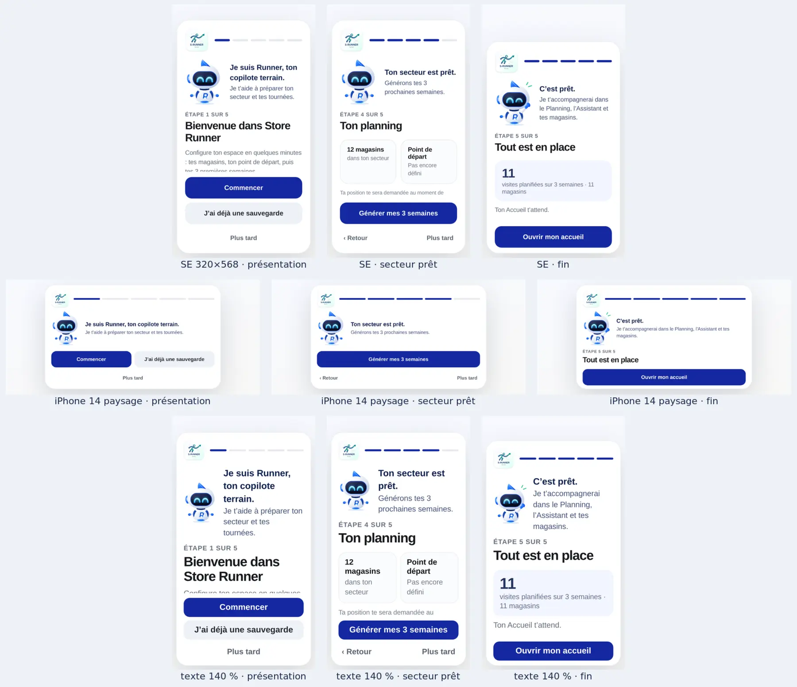

Sortie de Runner de derrière le logo, une seule fois par document (mouvement V270, images figées du trajet : caché, tête, sortie, arrivée) :

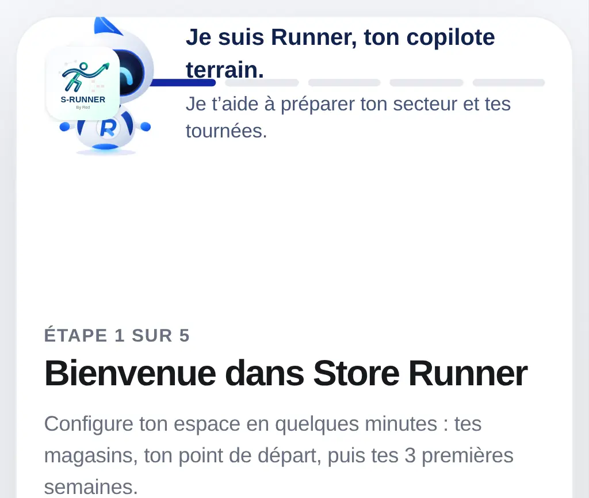 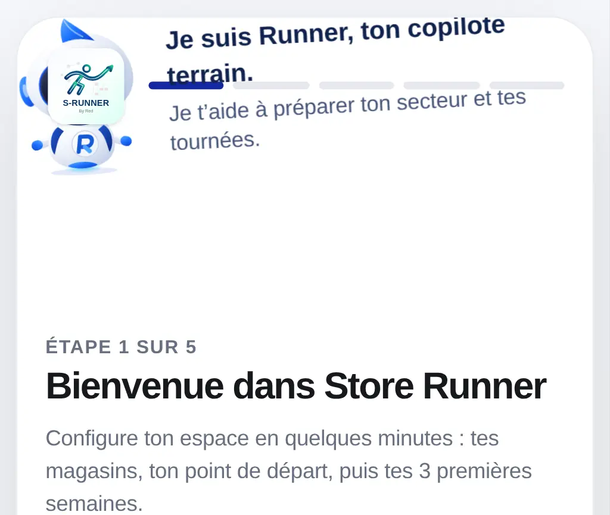 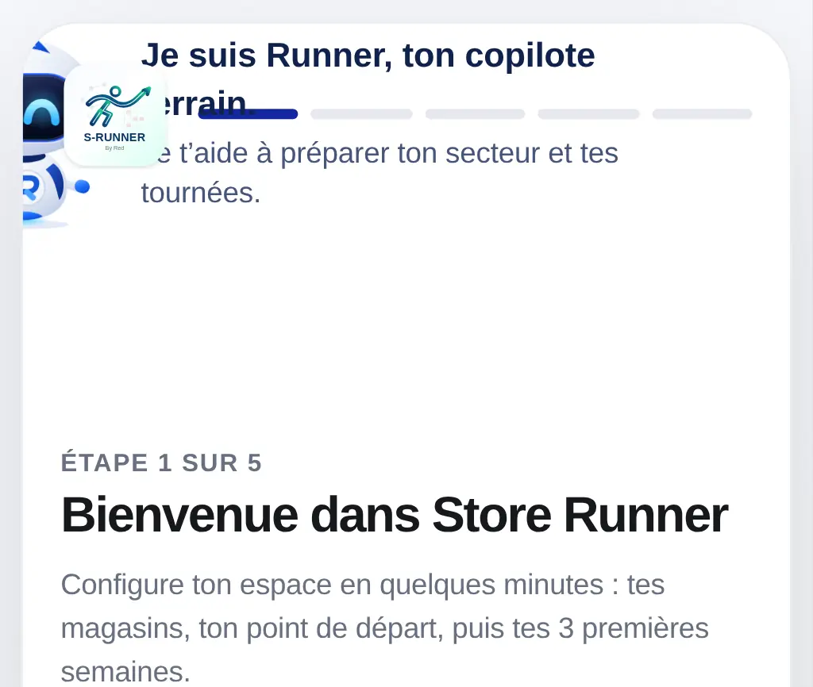 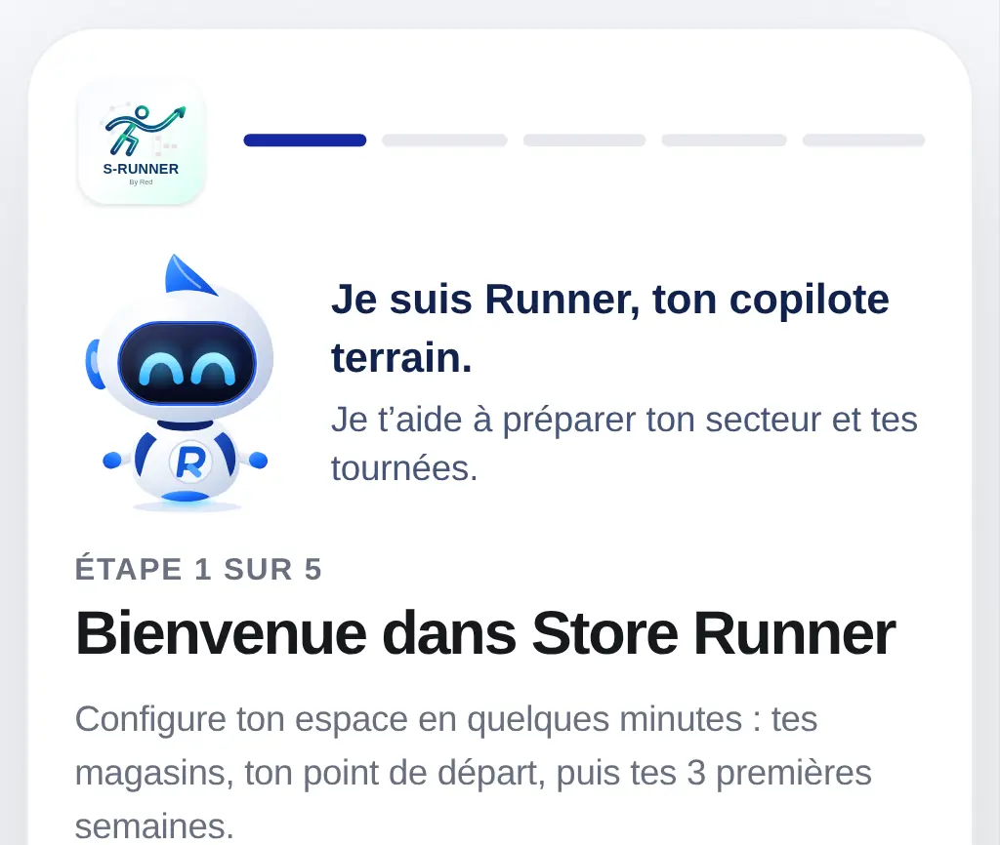

Les captures sont régénérées par `RUNNER_SHOTS_DIR=/chemin node tools/run-browser-tests.mjs tests/first-run-runner-v271-browser.spec.cjs` (le test de capture est ignoré sans cette variable).

### Exigences de l'issue → preuves

| Exigence (#503) | Preuve |
| --- | --- |
| Utilisateur neuf, sans donnée | `premier lancement : présentation, secteur, départ, génération, fin, accueil` (×3 profils) ; `boot-v234-browser.spec.cjs` (secteur vide, restauration accessible, redémarrage durable) |
| Utilisateur existant : aucun guide | `utilisateurs existants protégés` (5 cas : secteur + planning sans marqueur, marqueur « terminé » puis tout vidé, « plus tard », activité réelle, installation déjà faite ailleurs) |
| Interruption puis reprise à chaque étape | `reprise : l'étape se déduit de l'état réel à chaque interruption` (rechargements à chaque étape), `« Passer cette étape » est mémorisé`, relecture du marqueur de l'ancien parcours |
| Reprise en session après un renvoi vers Données ou le point de départ | `renvoi vers Données ou point de départ : revenir sans terminer reprend le guide…` : Retour d'Android (`page.goBack()` sur la sentinelle de `mobile-ux-v262.js`) et onglet Accueil ramènent au guide à la même étape ; un rendu de l'Accueil en arrière-plan ne le rouvre pas ; un seul observer, déconnecté à la reprise et à la fin du guide |
| Import interrompu (application fermée pendant l'import) | `reprise : un import interrompu` : repris à l'étape demandée si rien n'est arrivé, terminé si des données sont arrivées |
| Import de secteur | `import de secteur et départ par adresse` (écran Données puis reprise par `store-runner:home-rendered`) ; restauration : `restauration d'une sauvegarde` |
| Ajout/création de magasins | le parcours ×3 passe par le vrai dialogue `StoreRunnerStoreAdd` (12 magasins, `RegionStores.commit`) |
| Refus GPS / GPS indisponible | `position refusée puis indisponible…` ; faux `navigator.geolocation` qui enregistre ses appels : **zéro appel** au lancement, au rechargement, à « Passer cette étape » |
| Génération réussie et échec contrôlé | `génération refusée puis réussie` (un échec n'écrit aucun planning, « Réessayer » relance proprement) ; succès = `ok` du propriétaire **et** au moins une visite |
| Retour, navigation, rerender | `rendus répétés, navigation et historique` : même étape, même Runner, aucun rejeu de l'entrée |
| `prefers-reduced-motion` | `animations réduites` : aucun mouvement (garde sur `Element.prototype.animate`), états toujours distincts |
| Android 390 / 360 | profils `Android 390` et `Android 360 (Galaxy S8)` : aucune carte ne dépasse l'écran, cibles tactiles ≥ 44 px et action principale ≥ 48 px, aucun défilement horizontal |
| Petits écrans, paysage, texte agrandi, tablette | `petits écrans, paysage, texte agrandi, tablette` : iPhone SE 320×568, iPhone SE paysage 568×320, iPhone 14 paysage, Galaxy Note II 360×640 avec texte à 140 %, iPad Mini 768×1024 — à chaque étape, chaque bouton reste visible sans défiler, Runner visible, aucun débordement horizontal |
| iPhone / WebKit | profil `iPhone 14` en émulation Chromium avec zones sûres — **WebKit n'est pas disponible** dans ce harnais (voir « Ce qui reste ouvert ») |
| Sauvegarde/restauration inchangée | `restauration d'une sauvegarde` : le guide se termine, la sauvegarde ne contient aucun état du guide ; `tests/backups.test.cjs` inchangé |
| PWA / hors ligne | `PWA — le guide fonctionne hors ligne` : service worker actif, réseau coupé, reprise et parcours complet jusqu'à la génération |
| Aucune mutation métier depuis Runner | `aucune écriture métier depuis le guide ni Runner` (empreinte du `state` identique en naviguant, texte hostile inerte) + contrat statique (`first-run-runner-v271.test.cjs` : aucune affectation de `state`, aucune écriture hors nettoyage historique de la graine) |
| Aucune régression V268 / V269 / V270 | `runner-visual-v269.test.cjs` (mis à jour : quatre surfaces), `runner-movement-v270.test.cjs`, `runner-assistant-v268`, `runner-planning-v269`, `runner-home-v270`, `runner-visual-v268`, `runner-visual-android-v268` (suite navigateur complète) |

### Exécutions (sur la tête de la PR)

| Vérification | Résultat |
| --- | --- |
| Étapes Node/Python du job `verify` de Reliability, rejouées dans l'ordre du workflow | **176 / 176** |
| Contrat V271 (`tests/first-run-runner-v271.test.cjs`) | passe |
| Suite navigateur complète (`node tools/run-browser-tests.mjs`, Chromium 390 px, 319 tests) | résultat consigné dans le rapport de la PR #504 |
| Dont les 30 tests du nouveau parcours (29 exécutés, le test de captures est ignoré sans `RUNNER_SHOTS_DIR`) | passent |
| Benchmark Planning (`tests/planning-engine-benchmark-v253.test.cjs`) | identique à `main` : 58 magasins, 111 placements, 100 % de couverture, gain 338 km / 369 min |
| Syntaxe de tous les modules et scripts inline | passe |
| CI de la PR (Reliability `verify`, `mobile browser 390px`, Planning benchmark) | voir la PR |

### Ce qui reste ouvert

- **iPhone réel / WebKit** : validé uniquement sous émulation Chromium (profil iPhone 14, `Emulation.setSafeAreaInsetsOverride`). Le harnais du dépôt n'installe que Chromium. Une vérification sur un vrai iPhone reste à faire en test terrain PWA.
- **Ancien formulaire du premier lancement** (nom du secteur, prénom, capacité, objectif) : retiré du premier lancement ; les valeurs par défaut sont inchangées et se règlent dans Secteur / réglages du planning.
- **« Plus tard »** ferme le guide pour de bon (marqueur `dismissed`, comme avant V271). Il ne se rouvre que par `StoreRunnerNavigation.openFirstRun()`.
- **Bouton Retour d'Android** : pendant que le guide est ouvert, il garde son comportement standard (sortie de l'application, reprise au lancement suivant) — `mobile-ux-v262.js` reste seul propriétaire de l'historique et le guide ne lui ajoute aucune entrée. Depuis l'écran Données ou point de départ, Retour ramène à l'Accueil et le guide reprend. Le guide a son propre bouton Retour entre ses étapes.
- **Toasts** : pendant que le guide est ouvert, les toasts passagers de l'application et l'annonce « mise à jour installée » du premier lancement sont masqués par une règle CSS limitée au guide ; une bannière qui attend une réponse reste visible.
- **Fenêtre minuscule** : si l'application est tuée entre la réussite de la génération et l'écriture du marqueur, le guide se termine en silence au lancement suivant (`setup-complete`) au lieu d'afficher l'écran de fin.
- **Mise en page** : sur téléphone, la carte du guide est ancrée en bas (actions sous le pouce) sur un fond neutre opaque ; sur écran large, elle est centrée. Point à valider visuellement.
- **Attente du propriétaire** : pendant la recherche de position ou la génération, le guide attend la réponse du propriétaire sans délai propre — il n'invente jamais un échec ; les délais sont ceux de `StoreRunnerProfile` et du générateur. Les boutons restent désactivés tant qu'elle n'est pas arrivée.
- Annonce vocale : la voix de Runner (titre + texte) est annoncée à chaque changement d'étape ou d'état, l'alerte se tait au profit de la note `role="alert"` ; la composition titre + texte produit un « .. » inoffensif à la lecture.
- Playwright local 1.56.1 (CI : 1.55.0) ; l'option de contexte `reducedMotion` n'est pas appliquée localement, le test utilise `page.emulateMedia`.
