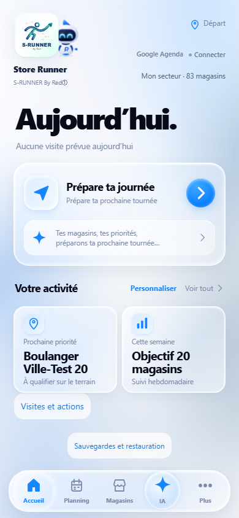
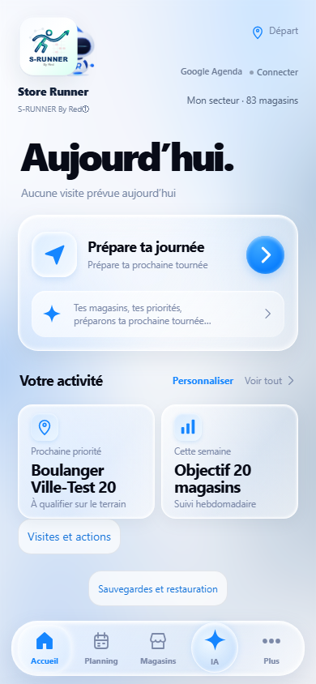
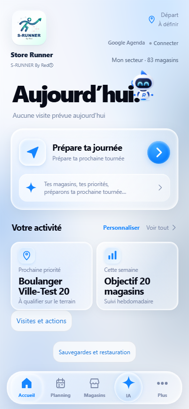
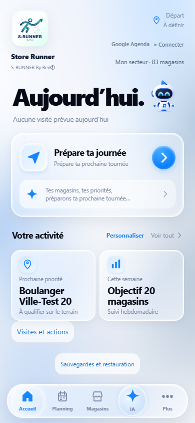

# Runner — déplacement visuel V270

`runner-visual.js` conserve le personnage SVG et ajoute un déplacement générique à son API de présentation. L’écran fournit les ancres DOM et décide quand appeler cette API. Runner ne connaît aucun écran, aucune date, aucune donnée et aucun moteur.

```js
const runner = Runner.mount(destinationSlot, {
  state: 'neutral', size: 'sm', decorative: true
});
runner.moveTo(destinationSlot, {
  from: originAnchor,
  duration: 1180,
  entrance: 'peek',
  animate: true,
  fallback: originSlot
});
```

`instance.moveTo(destination, options)` accepte un élément ou un sélecteur pour la destination, `from`, `fallback` et le mode générique optionnel `entrance:'peek'`. Il retourne `true` lorsque le placement est accepté, `false` lorsqu’aucune destination valide n’existe ou que l’instance a été détruite. `Runner.moveTo` applique le même appel au dernier Runner monté encore présent.

La destination est un conteneur vivant, connecté au même document, fourni par l’écran hôte. Runner y conserve sa place dans le flux. Le centre de la figure arrive depuis le centre de l’ancre `from` ; sans `from`, le déplacement part de la position actuelle de la figure. Une première animation est possible lorsque Runner est déjà monté à destination. Les appels suivants vers le même conteneur ne rejouent pas l’animation. Pour changer de zone, l’écran appelle la même méthode avec un autre conteneur.

Le déplacement utilise Web Animations, uniquement `transform` et `opacity`, pour un passage borné. La durée demandée est limitée à 240–1 400 ms. Le mode `peek` dure 1 180 ms : Runner reste d’abord partiellement masqué par le logo, passe la tête, cligne deux fois, incline légèrement la tête, regarde vers sa destination, sort du logo puis parcourt le trajet existant. Son opacité reste à 1 pendant toute cette entrée : le logo et le déplacement produisent seuls l’apparition, sans délavage. L’hôte, la tête et les yeux partagent la même durée et sont annulés ensemble, sans timer. Le mode standard conserve son passage de 680 ms. Le SVG n’est jamais reconstruit ; les futurs emblèmes ou skins restent indépendants de cette API.

Le conteneur Runner reçoit `pointer-events:none`. L’écran garde la responsabilité de la place réservée, des marges, du défilement et des safe areas. L’API n’ajoute aucun bouton, aucun message et aucune justification.

Avec `prefers-reduced-motion: reduce`, `motion:'off'`, `animate:false`, une origine non mesurable ou un navigateur sans Web Animations, Runner apparaît directement à destination. Une destination absente ou retirée du document utilise uniquement le `fallback` explicite et connecté de l’hôte ; sans repli valide, Runner garde sa place et tout déplacement actif est annulé.

`instance.cancelMove()` annule le trajet et révèle la place finale déjà réservée. Il retourne `true` lorsqu’un déplacement était actif. `instance.isMoving()` indique si un effet est encore en cours. Un nouveau trajet annule l’effet précédent. La fin du trajet, `destroy`, `unmount` et la purge d’un hôte retiré libèrent l’effet et ses callbacks. La purge détruit aussi les timers de bulle éventuellement demandés par cet hôte.

Le déplacement ne conserve aucune mémoire globale par écran. L’écran doit garder son propre drapeau de premier passage lorsqu’il détruit et recrée son DOM ; les remontages et les retours de navigation peuvent alors utiliser `animate:false`. Aucun stockage n’est nécessaire.

Tests : `tests/runner-movement-v270.test.cjs` couvre identité SVG, géométrie, entrée au même parent, rejeu, reduced motion, absence d’ancre/API navigateur, repli, interruption, destruction et purge sans lecture métier. Le comportement dans l’Accueil est validé dans la suite navigateur V270.

## Accueil V270

`home-refresh-v2.js` monte Runner neutre et décoratif près du titre de la journée réellement affichée, au-dessus de la carte de préparation. L’ancre de départ chevauche le logo Store Runner, qui masque le corps au début de l’entrée. Le contexte Aujourd’hui / Demain reste celui déjà produit par l’Accueil ; l’adaptateur de présence n’accède ni à `state` ni au stockage.

Une seule entrée est jouée par document. L’Accueil garde ce choix en mémoire, détruit sa présence quand il quitte l’écran ou remplace son DOM, puis la remonte directement à destination au retour. Aucun observer, écouteur ou timer supplémentaire n’est créé. L’absence de carte ou d’origine laisse Runner directement à destination ; l’absence du composant reste sans erreur.

Le R de V269 est conservé. Le déplacement anime l’enveloppe du composant, sans reconstruire le SVG : les futurs skins restent indépendants de cette API. Aucun module du Planning n’est modifié. Seule exception autorisée : l’assertion de révision du test navigateur Planning vérifie désormais `version.json.latestBuild`, sans changement de ses assertions comportementales.






Base intégrée : `df4b608edd0af7c91edea1e93e3a3b3191508683` (main après V269 et le hotfix r44, PR #502). V270 est rebasée sur cette fusion. Build : `20261005-r46-runner-home-270`, version visible 270, budget de démarrage inchangé (77 scripts). `sw.js` ne change que de révision.
