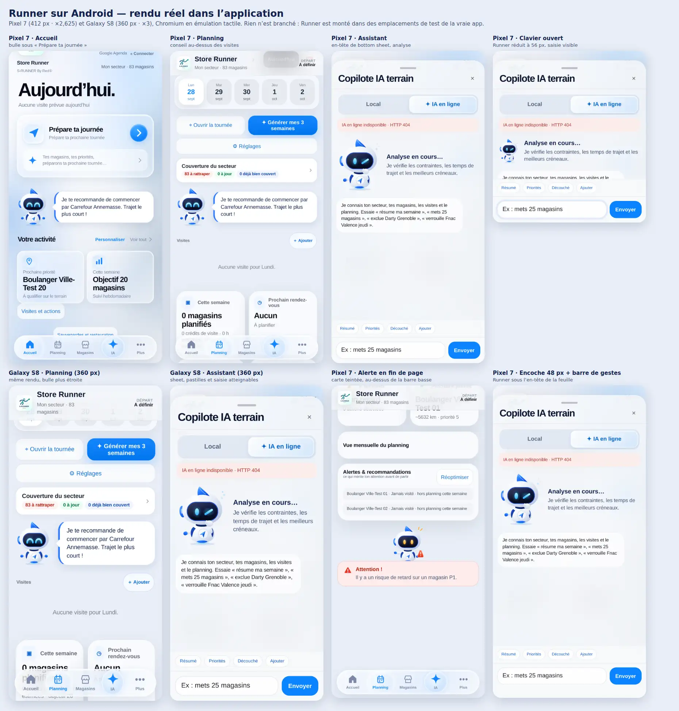
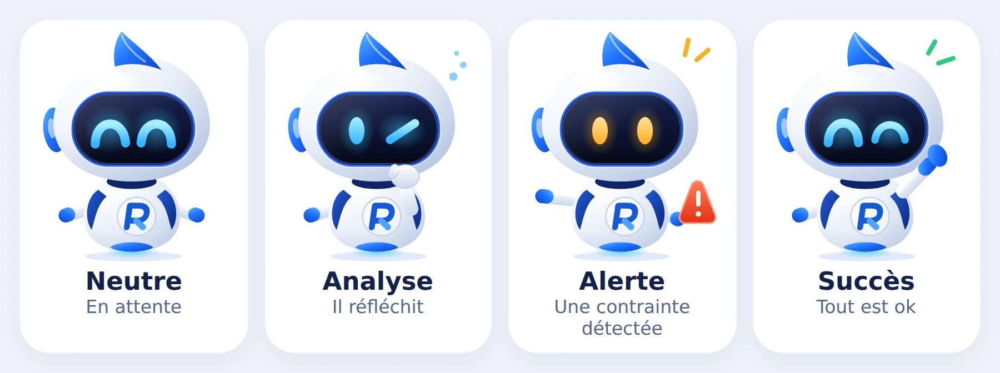
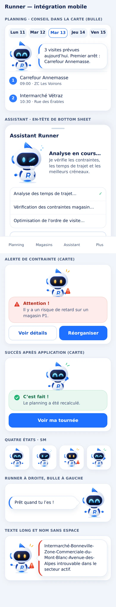
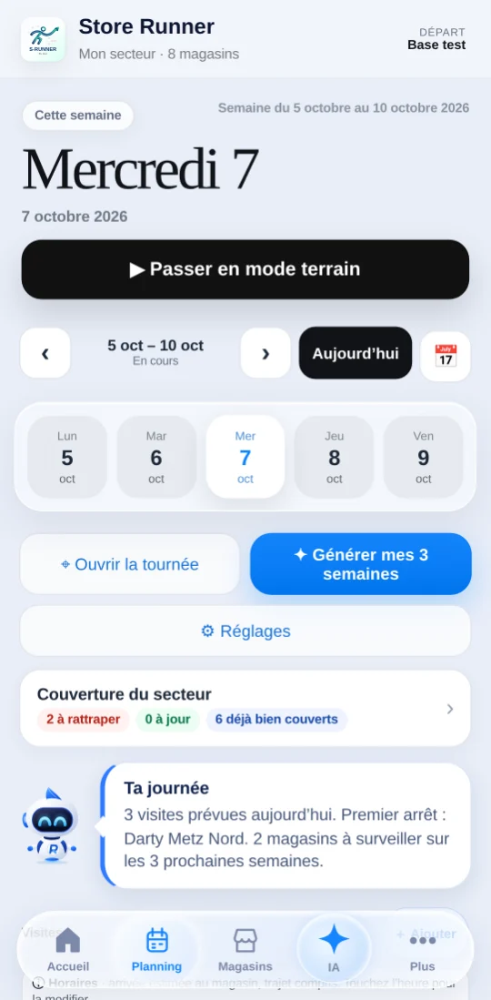
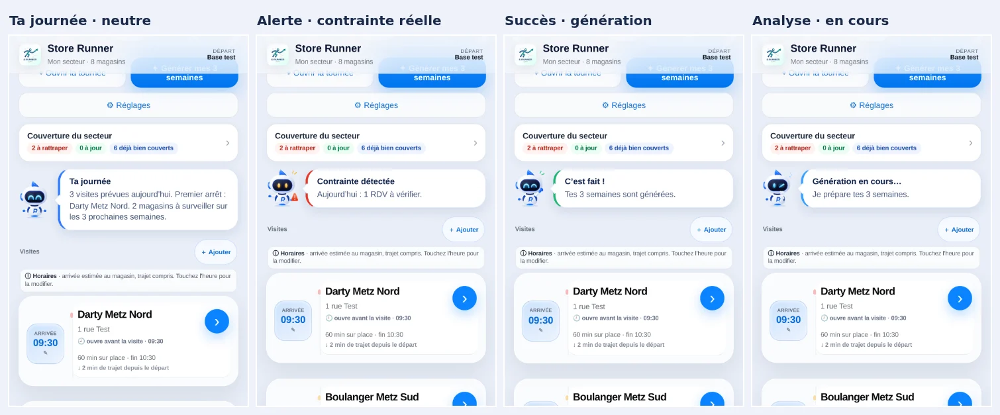

# Runner Visual System V1

Runner est le copilote **visuel** de Store Runner : un personnage, quatre états, une bulle. Il est visible dans **l'Assistant** (V268), le **Planning** (V269), l'**Accueil** (V270, `RUNNER_MOVEMENT_V270.md`) et le **premier lancement guidé** (V271, `RUNNER_FIRST_RUN_V271.md`), et, depuis **Runner Ambient V1** (`RUNNER_AMBIENT_V1.md`), dans une couche ambiante flottante unique (`runner-ambient.js`, instance détachée, `pointer-events:none`, jamais au-dessus de la barre basse) ; nulle part ailleurs : chaque propriétaire d'écran le monte et traduit ses propres signaux en état visuel. Forecast, Command Engine, moteurs de planning et Explorer Terrain ne le connaissent pas.

**Mobile uniquement, Android d'abord.** Store Runner est Android-first : Runner a été pensé et validé sur Android, puis adapté à l'iPhone. Il n'a aucune mise en page desktop : sa feuille de style ne contient aucune requête de largeur. Références : **Pixel 7 (412 px)** et **Galaxy S8 (360 px, Samsung)**, puis iPhone 14 ; 320 px sans défilement horizontal. L'application installée est verrouillée en portrait (`portrait-primary` dans le manifeste) : le paysage n'est pas un cas de conception, seulement de robustesse. En cas de doute entre desktop et mobile, c'est le mobile qui a été choisi.

- Build courant `20261007-r64-departure-display-hotfix-276`, version visible **276** (« Quoi de neuf » : « Runner suit ce que tu viens de faire » ; V275 « Runner prend sa place, les contrats deviennent lisibles », V273 « Runner a du caractère », V272, V271, V270, V269 et V268 restent dessous).
- Budget de démarrage **78 scripts** (V273 : `runner-behavior.js`, le module de personnalité, décision D2 explicitement validée ; Runner lui-même reste `runner-visual.js`, posé en V268) et entrée de shell dans `sw.js` : décisions explicitement validées.
- **Personnalité (V273)** : `runner-visual.js` ignore la personnalité et ses textes ; il ne gagne que deux gestes génériques dans `react()` (`'nod'` et `'look'`, `transform` seulement). Voir `RUNNER_PERSONALITY_V273.md`.
- Module : `runner-visual.js` (`StoreRunnerRunner`, alias `Runner`). Un seul fichier, aucune dépendance, aucune feuille séparée.







## Extension de présence V271.1

Le contrat suivant évolue explicitement pour #506 : `setPresence(true)` active une présence neutre locale ; `setPresence(false)` annule idle, trajet/retour, effets CSS et timers de cette instance, puis retire ses écoutes. `returnToRest({duration,offsetX,offsetY})` joue un retour générique sans connaître un écran. Le montage par défaut reste statique. Les états analyzing/alert/success suspendent l'idle ; neutral le reprend avec un délai variable avant le prochain clignement. Les seuls abonnements de Runner sont bornés à une présence ou un trajet actif : préférence système, visibilité, pagehide/pageshow. Ils ne relisent ni ne rendent aucune donnée métier. Contrat détaillé et preuves : [Runner Presence System](RUNNER_PRESENCE_V271_1.md). Les descriptions historiques « aucun écouteur » et « aucune animation au repos » s'appliquent au montage statique, pas à la présence explicitement activée.

## Apparence V272

La feuille native Runner est ouverte par le bouton hôte de l’Accueil ou Plus → Apparence (`navigation-controller.js`). `instance.react()` joue un clignement neutre de 240 ms avant l’ouverture ; sa promesse se termine aussi à l’annulation. Aucun mouvement en mode réduit, aucune réaction qui remplace analyzing/alert/success. Le personnage et ses couleurs sémantiques restent identiques ; seule la surface de bulle suit le thème sombre. Contrat : `APPEARANCE_V272.md`. Personnalité V273 non implémentée.

## Direction visuelle

Les planches officielles Runner V1 fixent l'identité : silhouette en goutte, tête nacrée, **visière sombre** à liseré bleu, yeux lumineux, **crête bleue** type aileron, pastilles d'oreille bleues (une de chaque côté), corps ovoïde blanc, **emblème « R »** (V269 : un R stylisé bleu et blanc, dans le disque du torse, en remplacement de la flèche de navigation), mains bleues, halo bleu sous le corps, palette blanc/bleu. Le dessin les reprend sans réinterprétation : seuls les yeux, les bras et les effets changent d'un état à l'autre. La planche d'intégration mobile (Planning, Assistant en bottom sheet, alerte, succès) fixe la mise en page, pas l'identité.

| État | Yeux | Geste | Effet |
| --- | --- | --- | --- |
| `neutral` — En attente | deux arches cyan | bras ouverts | aucun |
| `analyzing` — Il réfléchit | un ovale, un trait oblique | main au menton | trois points bleus |
| `alert` — Une contrainte détectée | deux ovales ambre | bras tendu | pastille rouge « ! », éclats ambre |
| `success` — Tout est ok | une arche, un clin d'œil | main bleue levée | éclats verts |

**Emblème « R » (V269).** Le disque du torse porte un **R stylisé** : fût et panse bleu profond (`#1558d6`), jambe bleu clair (`#4da3ff`, la même paire que l'ancienne flèche), légèrement incliné pour garder le mouvement du personnage. Il est tracé en **courbes** (deux chemins SVG, aucune police, donc rien à précacher), trait de 7 unités sur un dessin de 240 × 280 : à 56 px de large (taille du Planning) le fût et la panse restent lisibles, à 88 et 120 px la jambe aussi. Le disque (rayon 23, centre 124 × 224) et toutes les proportions du personnage sont inchangés ; l'emblème est le même pour les quatre états.

**Limite connue, à lire.** Les planches fournies sont des images raster sans source maître (ni SVG, ni PNG transparent, ni modèle 3D) ; le rendu 3D n'est pas extractible proprement (fond dégradé, ≈ 150 px de haut pour un état). Le dessin est donc un **redessin vectoriel** fidèle aux formes, aux couleurs et aux proportions, mais plus « à plat » que le rendu 3D (ombres et reflets simplifiés). Si le design livre l'art maître, il remplace le gabarit SVG de `runner-visual.js` sans toucher à l'API ni aux écrans hôtes.

Pas d'actifs raster dans le runtime : un SVG inline reste net à toute densité (Android 2–3×, iPhone 3×), pèse ≈ 11 Ko par instance et ne demande aucun fichier de plus à précacher. Un jeu WebP/PNG ne se justifiera que pour une surface qui ne peut pas porter de SVG (notification système, carte de partage) : décision à prendre alors. Les deux WebP de `tests/fixtures/` ne servent qu'à relire cette PR.

## Intégration native mobile : trois variantes, toujours dans le flux

| Variante | Surface | Composition |
| --- | --- | --- |
| `bubble` (défaut) | **carte Planning (V269, taille `sm`, 56 px)**, message de l'assistant | Runner (88 px par défaut, 56 px dans le Planning) à côté d'une bulle blanche à accent d'état et queue vers lui ; `side:'left'` inverse |
| `sheet` | en-tête du bottom sheet Assistant | Runner (120 px) et texte **sans cadre** ; titre 16,5 px |
| `panel` | carte d'alerte de contrainte, carte de succès | Runner (88 px) centré **au-dessus** d'un bloc teinté pleine largeur, pictogramme ⚠ ou ✓ |

Règles mobiles, vérifiées par les tests :

- **Aucun personnage flottant.** Runner n'est jamais `fixed`, jamais `sticky`, n'a aucun `z-index`, aucun `inset`, aucune unité de viewport. Il occupe de la place dans le flux de l'écran hôte : il ne peut donc masquer aucune action principale, ni la barre de navigation basse, ni le bouton IA.
- **Discret.** Tailles de téléphone : `sm` 56 · `md` 88 · `lg` 120 px (plafond numérique 144 px, plus de `xl`). Une bulle sans texte n'existe pas ; `duration` la referme seule.
- **Safe areas.** Runner n'est ancré à aucun bord de l'écran, donc il ne peut ni passer sous l'encoche, ni sous la barre de gestes, ni sous la barre d'état. Les marges `env(safe-area-inset-*)` des feuilles, barres et pages restent à leur **propriétaire** ; la fixture montre le montage correct (sheet et barre basse de l'hôte) et le test émule trois situations (iPhone encoche + barre d'accueil, Android barre de gestes, paysage avec encoche).
- **Les actions appartiennent à l'hôte.** « Voir détails », « Réorganiser », « Annuler », « Voir ma tournée » sont les boutons de l'écran, au style de l'app, cibles ≥ 48 px. Runner ne dessine aucun bouton ni lien, ne prend jamais le focus et sa figure ne capte aucun tap (`pointer-events:none`) : le centre de chaque bouton de l'hôte reste atteignable.
- **Largeur : celle du conteneur.** La bulle prend la largeur restante, coupe les noms sans espace (`overflow-wrap:anywhere`) et ne déborde ni de sa carte ni de l'écran à 320, 360 et 390 px. Texte ≥ 14 px, police héritée de l'application.
- **Contrastes AA.** Toutes les paires texte / fond (encre, texte secondaire, titres d'alerte et de succès sur leurs teintes) sont ≥ 4,5:1, vérifiées par le test unitaire.

## Validation Android dans la vraie application

La page d'aperçu n'a pas suffi : c'est le test dans l'application réelle, sous **Pixel 7** et **Galaxy S8** émulés (toucher, DPR 2,6 / 3, UA Android), qui a trouvé un vrai défaut et qui fixe les comportements ci-dessous. Ce spec date d'avant le branchement : il monte Runner dans des emplacements de test de l'accueil, du Planning et de l'Assistant (comme le ferait n'importe quel hôte futur) (`tests/runner-visual-android-v268-browser.spec.cjs`, captures en `RUNNER_SHOTS_DIR`).

**Défaut trouvé et corrigé.** L'application contient `#premiumHomeV2 svg, .bottomAppNav svg { width:24px; height:24px; display:block }` (règle d'icônes à identifiant). Sur l'accueil, elle réduisait le dessin de Runner de 88 px à 24 px (la boîte de la figure restait à 88 px, ce que mesuraient mes premiers tests) et rendait visibles les pictogrammes masqués des cartes. Runner impose désormais sa taille et son affichage SVG avec `!important`, strictement limité à ses trois règles SVG (vérifié par le test unitaire). **Garde-fou permanent :** le test « Isolation du style » compare, élément par élément, les styles calculés de cinq combinaisons de Runner (bulle, bulle à gauche, sheet, carte alerte, carte succès) dans l'accueil, le Planning et l'Assistant réels contre une page témoin sans règle d'application : zéro écart exigé (mutation vérifiée : retirer le `!important` fait échouer le test avec `88px` contre `24px`).

| Comportement Android | Résultat vérifié |
| --- | --- |
| Alignement et espacement | Runner prend la largeur exacte des cartes de l'app (écart ≤ 1 px à gauche et à droite), rayon 22 px proche des cartes (24–25 px), hauteur d'un Runner `md` < 17 % de l'écran |
| Barre basse flottante de l'app | jamais recouvert : en fin de page le dernier bloc reste au-dessus, y compris avec une barre à trois boutons (inset bas 48 px) |
| Toucher réel | une pastille de l'Assistant touchée au doigt exécute son gestionnaire, Runner ne bouge pas ; la figure ne capte aucun tap |
| Défilement | un glissement du doigt **commencé sur Runner** (figure ou bulle) fait défiler la page (événements tactiles du navigateur) |
| **Clavier ouvert** (`interactive-widget=resizes-content`) | Runner passe de 120 à **56 px** via l'attribut public `html[data-sr-keyboard="open"]` posé par `mobile-ux-v262.js` (lecture seule, aucun écouteur) ; la saisie reste visible, le titre de la feuille aussi, puis Runner retrouve 120 px |
| **Bouton retour** | le retour referme la feuille de l'app comme avant ; Runner ne l'intercepte pas, reste monté et inchangé |
| Police système agrandie (≈ 150 %) | le texte de bulle grandit, rien ne déborde, Runner ne passe pas sous les pastilles, la figure ne grossit pas |
| Rendus répétés de l'app | six rendus successifs par `innerHTML` laissent une seule instance de Runner (purge à `mount`) |

**Constats sur l'application elle-même (non corrigés ici, hors périmètre de Runner).**

1. **Feuille de l'Assistant et zone haute.** Elle est fixée à ≈ 26 px du haut et ne lit pas `env(safe-area-inset-top)`. Sans encoche, sans effet. Sous une encoche, un trou de caméra ou un affichage bord à bord (Android 15), son grabber et son titre peuvent passer sous la barre d'état. À vérifier sur appareil réel par le propriétaire de la feuille **avant** d'y intégrer Runner. Le spec consigne la mesure (annotation « constat feuille Assistant ») sans l'imposer.
2. **Réordonnancement du Planning.** `planning-ui-fixes.js` déplace ses blocs un instant après le rendu : un conteneur posé « à côté » d'un bloc avant ce réordonnancement reste derrière. Le propriétaire d'un écran doit monter Runner **dans son propre rendu**, comme ses autres blocs ; `home-refresh-v2.js` redessine aussi l'accueil. `mount` ne fuit pas si le redessin retire Runner.
3. **Conteneurs de l'accueil.** `#premiumHomeV2` ordonne ses blocs avec `order` : un conteneur d'intégration doit copier celui de son voisin (le spec le fait).

**Safe areas Android émulées** (CDP `Emulation.setSafeAreaInsetsOverride`) : barre d'état (haut 32 px), trou de caméra + barre de gestes (48 / 24 px), navigation à trois boutons (32 / 48 px). Runner étant dans le flux, il ne peut ni passer sous une barre ni sous l'encoche ; ce sont les marges de l'hôte qui comptent (la fixture montre le montage correct d'un sheet et d'une barre basse).

**iPhone, ensuite.** Safari/WebKit n'est pas installé dans l'environnement de test : l'iPhone 14 est validé sous **émulation Chromium** (UA, taille, DPR, safe areas encoche 47 px + barre d'accueil 34 px) pour Planning et Assistant. Non vérifiable ici et à contrôler sur un iPhone réel (phase de test terrain PWA) : le rendu WebKit du SVG et de `transform-box`, `min()` dans `calc()`, le clavier iOS (qui ne redimensionne pas le contenu : la réduction de Runner à 56 px s'appuie sur l'attribut de `mobile-ux-v262.js`, qui lit `visualViewport`), et l'encoche réelle.

## Branchement V271 : le premier lancement guidé

`navigation-controller.js`, propriétaire du premier lancement, monte Runner dans la **scène** de la carte du guide (variante `sheet`, taille `md` comme l'Assistant, `decorative:true` : le texte voisin porte le sens). La scène n'est jamais réécrite entre deux étapes, donc **une seule instance** vit pendant tout le guide ; elle est détruite à sa fermeture. La sortie de derrière le logo (`moveTo(scène, { from: logo, entrance: 'peek', duration: 1180 })`, mouvement V270) n'est jouée **qu'une fois par document**, après la levée du voile du shell (sinon elle serait consommée sous le chargement) ; retour, nouvel état, nouveau rendu ou reprise à une autre étape posent Runner directement. `prefers-reduced-motion` : aucun trajet, placement direct.

Runner ne dit que ce que l'état réel ou un propriétaire a produit :

| Étape | Neutre | Analyse | Alerte | Succès |
| --- | --- | --- | --- | --- |
| Présentation | « Je suis Runner, ton copilote terrain. » | | | |
| Secteur | aucun magasin | | | `state.stores` contient N magasins réels |
| Départ | pas encore de départ valide | recherche de position en cours (`StoreRunnerProfile.resolvePlanningOrigin`) | refus ou indisponibilité, message du propriétaire dans la note | `storeRunnerHasValidBase()` |
| Planning | « Ton secteur est prêt. Générons tes 3 prochaines semaines. » | `storeRunnerGenerateThreeWeeks()` en cours (« Je prépare tes 3 semaines. ») | échec du propriétaire, message tel quel | |
| Fin | | | | génération réussie : « C'est prêt. Je t'accompagnerai dans le Planning, l'Assistant et tes magasins. » |

**Renvois et reprise.** Quand le guide envoie l'utilisateur vers l'écran Données ou point de départ, il se range et ne garde qu'un observer borné sur la classe de `#homePanel` : le retour sur l'Accueil sans avoir terminé (bouton Retour d'Android, onglet Accueil) le fait reprendre à la même étape ; l'observer est déconnecté à la reprise et à la fin du guide. Un rendu de l'Accueil en arrière-plan ne reprend rien.

**Écrans courts.** Sur téléphone, la carte du guide est ancrée en bas (actions sous le pouce) et ses actions restent collées à son bord inférieur : si le contenu dépasse (iPhone SE 320 px, texte agrandi), c'est le contenu qui défile sous elles, jamais l'action principale qui sort de l'écran. En écran court (`max-height:480px` : téléphone en paysage, fenêtre partagée), la carte se resserre et les actions passent côte à côte. `touch-action:manipulation` évite le zoom d'un double toucher rapide. Aucun `:has()` : une classe suffit (absent avant iOS 15.4).

La voix de Runner est ici le contenu du guide (sa bulle visuelle est masquée aux lecteurs d'écran) : elle est annoncée à chaque changement d'étape ou d'état ; seule l'alerte se tait (`silent`), parce que sa note `role="alert"` porte le message du propriétaire et ne doit pas être lue deux fois. Le guide ne lit aucune donnée métier autre que le nombre de magasins, le départ et le résultat du propriétaire de la génération, n'écrit rien dans `state`, n'appelle aucun moteur directement et n'emploie aucun mot que personne ne fournit (« optimisé », « meilleur », « optimal »).

## Branchement V269 : le Planning





**Emplacement.** `planning-ui-fixes.js`, propriétaire de la hiérarchie du Planning, pose `#planningRunnerV269` **entre le bloc Couverture et la liste des visites** (`reorderPlanning`, même mécanisme que les autres blocs : Actions › Couverture › **Runner** › visites). L'emplacement est dans le flux (`pointer-events:none`, aucun `fixed`, aucun `sticky`, aucun `z-index`), **masqué** (`hidden`, hauteur 0) quand il n'y a rien d'utile à dire, jamais un cadre vide. Runner y est monté **en variante `bubble`, taille `sm` (56 px)** : une carte basse, discrète, qui ne recouvre ni les cartes, ni les actions, ni la barre basse. Aucun nouveau script de démarrage : l'adaptateur vit dans `planning-ui-fixes.js` (budget **77** inchangé).

**Runner ne décide rien, ne calcule rien, n'écrit rien.** L'adaptateur lit des faits que d'autres propriétaires produisent déjà et les traduit en état visuel :

| Ce que Runner dit | Source (propriétaire) |
| --- | --- |
| nombre de visites, premier arrêt | plan affiché (`state.plan`), ordre de passage du plan |
| RDV à vérifier, magasin sans créneau disponible, fin estimée après la limite | `StoreOpeningHoursV1.scheduleRoute` (déjà lu par les alertes du planning), **dans ses propres mots** |
| magasins à surveiller sur 3 semaines | `StoreRunnerVisitCoverage.forecastThreeWeeks(...).counts.watch.total` (Forecast V267) |
| rendez-vous ou jour posé hors des jours disponibles | `forecastThreeWeeks(...).counts.constraintIssues` |
| succès après génération 3 semaines / recalcul / commande | événements publics `chef-range-generated`, `store-runner:planning-updated` (source `recalculatePlanningCascade`), `store-runner:planning-command-applied` |
| génération en cours | marqueur d'occupation (`disabled`) du bouton « Générer mes 3 semaines » de `planning-generation-controller.js` |

**Aucune justification inventée.** « Premier arrêt : Darty Metz Nord » nomme l'arrêt sans dire pourquoi il l'est : aucun propriétaire ne fournit ce motif, donc ni « trajet le plus court », ni « meilleur choix », ni « priorité optimale ». Le test unitaire interdit ces mots dans l'adaptateur.

**États, du plus au moins prioritaire :**

| État | Quand | Texte (exemple) |
| --- | --- | --- |
| `success` | un événement de succès vient d'arriver **et le Planning est ouvert** ; dure 6 s (`resetAfter` de Runner, un seul timer), puis la journée reprend la main | « Tes 3 semaines sont générées. » · « Le planning a été recalculé. » · « La commande a été appliquée au planning. » |
| `analyzing` | le bouton « Générer mes 3 semaines » est occupé (opération en cours) | « Je prépare tes 3 semaines. » |
| `alert` | jour courant ou futur : l'ordonnanceur signale un RDV à vérifier, un magasin sans créneau ou une fin estimée au-delà de la limite ; sinon le forecast signale une contrainte explicite hors des jours disponibles | « Aujourd'hui : 1 RDV à vérifier. » |
| `neutral` | le reste | « 3 visites prévues aujourd'hui. Premier arrêt : Darty Metz Nord. 2 magasins à surveiller sur les 3 prochaines semaines. » |

**Selon le jour affiché :**

- **Aujourd'hui ou futur, avec visites** : résumé (nombre, premier arrêt, magasins à surveiller s'il y en a) ou alerte.
- **Aujourd'hui ou futur, sans visite** : « Aucune visite prévue jeudi 8. » suivi du forecast s'il y a des magasins à surveiller ; **Runner est masqué** quand il n'y a rien d'utile (tout est à jour).
- **Jour passé ou historique** (semaine archivée) : « 1 visite était prévue lundi 5. » — **aucune alerte, aucun forecast, aucun conseil** sur un avenir qui n'existe pas ; masqué si le jour passé est vide. « Prévue » dit ce que le planning contenait, pas ce qui a été fait.
- Le plan chargé doit être celui de la semaine du jour affiché, sinon Runner attend le rendu suivant.

**Coût et fraîcheur.** Le forecast coûte de 30 à 300 ms selon la taille du secteur : changer de jour **ne le relit pas**. La lecture est mémorisée pour le jour, la semaine et une **empreinte** des données qu'il lit dans `state` (visites, rendez-vous, jours posés, magasins) : marquer « Visité » (qui n'émet aucun événement) relance donc le calcul. Elle est aussi oubliée aux événements qui changent des données hors de `state` (génération, restauration, agenda, ajout de magasins, ouverture du Planning, commande) et, au plus tard, après une minute. Rien n'est persisté.

**Ce qui n'est pas fait, et pourquoi.**

- **`generateWeek` (une semaine) ne déclenche pas de succès** : son événement `planning-updated` (source `generateWeek`) est émis même si la génération échoue, donc il ne prouve pas un succès. Le bouton principal (3 semaines) émet `chef-range-generated` seulement à la réussite.
- **`analyzing` ne couvre que « Générer mes 3 semaines »** : aucun événement public de *début* n'existe ; le marqueur d'occupation du bouton est le seul signal fiable (levé dans un `finally`, jamais bloqué). Le recalcul en cascade n'a pas de signal de début : Runner n'affiche que son succès.
- **Un échec de génération n'a pas d'état** : le propriétaire l'affiche déjà (message rouge du bouton) et ne l'émet pas en événement.
- **Dépassement d'horaires ≠ toutes les alertes du planning** : Runner ne relaie que ce que l'ordonnanceur expose publiquement (RDV, créneau, fin estimée). Les alertes de `planning-pro-plus.js` (« presque plein », magasin en retard hors semaine) y restent.

**Accessibilité.** Le quotidien (neutre) n'est **jamais annoncé** (`silent`) ; une alerte, une analyse ou un succès qui *apparaissent* pendant que le Planning est ouvert le sont (`assertive` pour l'alerte). Une alerte déjà là à l'ouverture, ou après un rendu qui remonte Runner, n'est pas ré-annoncée. Rien de focusable.

**Pendant la saisie d'un réglage**, `run()` sort avant tout (verrou de `planning-ui-fixes.js`) : Runner n'est ni monté ni redessiné sous les doigts, pour ne pas refermer le sélecteur natif iOS.

## Branchement V268 : l'Assistant

`assistant-upgrade.js` (propriétaire des enrichissements de l'Assistant) monte Runner **à la première ouverture** du panneau, dans l'en-tête de l'Assistant (`#srAssistantRunner`, entre le statut et la liste des messages, variante `sheet`, 88 px). Au démarrage et panneau fermé : aucun nœud, aucun style. Le conteneur est en `pointer-events:none` : aucun toucher n'est intercepté.

L'état est **dérivé de ce que le chat montre déjà**, sans mémoire, sans persistance et sans timer, par trois observateurs bornés (classe du panneau, enfants directs de la liste des messages, statut) :

| État de Runner | Signal existant de l'Assistant |
| --- | --- |
| `analyzing` | le dernier message est la bulle « ✦ Je réfléchis… » de l'envoi en ligne |
| `alert` | le dernier message du bot est une erreur (« IA en ligne indisponible », « Erreur : », « Application impossible ») ou le statut est en erreur (`.ai-status.bad`) |
| `success` | le dernier message du bot confirme une action appliquée (« Commande appliquée » du Command Engine, « Actions appliquées » de l'IA, « Semaine générée », « a été régénéré ») |
| `neutral` | tout le reste, y compris après un nouveau message de l'utilisateur |

Les marqueurs de copie sont **épinglés par le test unitaire** (ils doivent exister dans le noyau ou le Command Engine) : si l'Assistant change un message, le test casse au lieu de laisser Runner afficher un état faux. L'état neutre est affiché sans annonce vocale (`silent`) : l'Assistant répond déjà à voix haute. Le Command Engine, le noyau et `generateWeek` ne sont pas modifiés ; Runner n'écrit rien (état de l'app et stockage strictement inchangés, vérifié).

## Ce que Runner ne fait jamais

- **Aucune donnée** : ni `state`, ni stockage, ni IndexedDB, ni agenda, ni performance, ni photos. Aucun nom de magasin n'y est lu.
- **Aucune décision** : il ne choisit, ne place, ne déplace ni ne simule aucune visite. Il n'est appelé par aucun moteur ; c'est le propriétaire d'un écran qui traduit le résultat de son moteur en état visuel, jamais l'inverse.
- **Aucun propriétaire contourné** : aucune fonction globale remplacée, aucun `window.xxx =` hors `StoreRunnerRunner` / `Runner`.
- **Aucune surveillance** : pas de `setInterval`, pas d'observateur, pas d'écouteur `focus` / `resize`, pas de `requestAnimationFrame`.
- **Aucun réseau**, aucune évaluation dynamique, aucun HTML dynamique : une bulle s'écrit en `textContent`. Un nom de magasin comme `` y reste du texte.

Au démarrage il ne fait strictement rien : aucun nœud, aucun style, aucun écouteur. La feuille de style n'est injectée qu'au premier `mount()`.

## API de présentation

L'API globale n'agit que sur le Runner **principal** (le dernier monté encore présent dans le document). Sans Runner monté elle ne crée rien et répond `false` : appeler `Runner.setState(...)` avant qu'un écran n'ait monté Runner est sans effet, jamais une erreur. Aucune méthode ne lève d'exception vers le code appelant.

```js
// L'écran hôte décide de l'emplacement ; Runner prend place dans son flux.
const runner = Runner.mount(container, { variant:'bubble', state:'neutral' });

Runner.setState('analyzing');                                  // true | false
Runner.showMessage('Je vérifie les contraintes…');             // bulle
Runner.showMessage({ title:'Attention !', text:'…' }, { state:'alert' });
Runner.setState('success', { message:'Le planning a été recalculé.', title:'C’est fait !', resetAfter:4000 });
Runner.hideMessage();
Runner.reset();                                                // neutre, bulle fermée
Runner.getState();                                             // 'neutral' | … | null
Runner.unmount(container | runner);
```

| Élément | Rôle |
| --- | --- |
| `Runner.STATES`, `STATE_LABELS`, `VARIANTS`, `SIDES`, `SIZES`, `TONES` | constantes gelées |
| `mount(conteneur, options)` | retourne l'instance, ou `null` si le conteneur est introuvable |
| options de `mount` | `variant` (`bubble` · `sheet` · `panel`, défaut `bubble`), `state`, `size` (`sm` · `md` · `lg` · nombre 32–144 ; défaut `md`, `lg` pour `sheet`), `side` (`right` · `left`), `message`, `title`, `duration`, `motion` (`'off'` coupe tout mouvement), `decorative` (aucun nom accessible) |
| `setState(état, { message, title, duration, resetAfter, side })` | état inconnu refusé (`false`), même état : aucun rejeu |
| `showMessage(texte \| { text, title, state, duration, side }, options)` | texte borné à 280 caractères, titre à 60, durée 1,5 s – 2 min (`0` : reste jusqu'à `hideMessage`) ; un texte vide ferme la bulle |
| instance | `el`, `variant`, `getState`, `setState`, `showMessage`, `hideMessage`, `reset`, `destroy`, `isConnected` |
| événement | `store-runner:runner-state`, émis sur l'élément et remontant dans le document (`bubbles`), `detail: { state, previous, id }`, seulement quand l'état change |

**Pas de fuite quand un écran se redessine.** Les écrans de l'app se redessinent souvent en `innerHTML`. Chaque `mount` oublie d'abord les Runners dont le conteneur a été retiré : six rendus successifs laissent une seule instance vivante. Un Runner monté dans un nœud pas encore attaché reste vivant jusqu'à son insertion, puis suit le document. `unmount` accepte l'instance ou son conteneur.

## Un état, pas une reconstruction

Tous les calques du dessin sont déjà dans le SVG ; `data-state` sur le conteneur en rend un seul visible (fondu 0,16 s). Changer d'état ne reconstruit aucun nœud, ne relit aucune donnée et ne crée aucun timer (sauf `duration` / `resetAfter`, demandés explicitement, un seul timer chacun, annulé par tout nouvel appel ou par `destroy`).

## Accessibilité

- La figure est `role="img"` avec un nom : « Runner, copilote terrain : en attente / il réfléchit / une contrainte détectée / tout est ok ». `decorative:true` la masque quand le texte voisin dit déjà la même chose.
- Une région `role="status"` (visuellement masquée) annonce la bulle et les changements d'état ; elle passe en `aria-live="assertive"` pour une alerte. La bulle visuelle est `aria-hidden` : pas de double lecture. Retour au calme : aucune annonce.
- `prefers-reduced-motion: reduce` coupe toute animation et toute transition ; les états restent distincts par les yeux, les gestes, les effets et le pictogramme. `motion:'off'` fait de même à la demande de l'écran hôte (captures déterministes).

## Mouvement et performance

- Animations en `transform` / `opacity` uniquement, pas de `will-change` permanent, **aucun filtre SVG** (les lueurs sont des formes translucides).
- Montage statique : **aucune animation**. Présence explicitement activée V271.1 : idle en séquences Web Animations finies, variables et annulables (contrat ci-dessus). Changement d'état : une entrée de 0,42 s, jouée une fois. Bulle : une entrée de 0,22 s.
- Une seule boucle existe, les trois points de `analyzing`, **bornée à 16 passages (≈ 22 s)** : un état oublié ne tourne jamais en continu sur la batterie d'un téléphone. Alerte : deux pulsations. Succès : une apparition des éclats.
- Poids : `runner-visual.js` ≈ 44 Ko, ≈ 13,2 Ko compressé (budget testé 45 Kio / 14 Kio) ; SVG ≈ 11 Ko et 153 éléments par instance ; identifiants de dégradés uniques par instance (un Runner masqué ne prive jamais un autre de ses dégradés). Si plus de quelques Runners coexistent un jour, le dessin pourra passer en sprite partagé ; inutile pour un à deux Runners par écran.

## Chargement et budget de démarrage

`runner-visual.js` est chargé avec les autres modules par `index.html` (avant `weekly-brief-import-v246b.js`, `mobile-ux-v262.js` restant le dernier module) et précaché dans le shell obligatoire de `sw.js`, comme tout ce que `index.html` charge. Il fait **77** ressources script au démarrage au lieu de 76 : le plafond de `CLEANUP_BASELINE_R20.md` / `tests/fixtures/cleanup-baseline-r20.json` est relevé d'une unité, comme pour `store-explorer.js`. **Budget 77 et modification de `sw.js` : décisions explicitement validées.**

## Points d'intégration futurs (non faits — l'Assistant est livré en V268, le Planning en V269)

Dans tous les cas, **le propriétaire de l'écran monte Runner et traduit son propre résultat** ; Runner ne lit jamais le résultat d'un moteur. Chacune demande sa propre PR, son propre test et une vérification 390 px (Android d'abord).

| Surface | Variante | Intégration envisagée |
| --- | --- | --- |
| Planning | `bubble` | **livré en V269** (voir plus haut) : résumé de la journée, alertes de l'ordonnanceur et du forecast, succès de génération / recalcul. |
| Assistant / Command Engine | `sheet` | **livré en V268** (voir plus haut). Une future intégration du Command Engine lui-même (aperçu, journal) reste une décision séparée. |
| Alertes de contraintes | `panel` | `alert` + titre / texte déjà produits par le propriétaire de la contrainte ; « Voir détails » / « Réorganiser » restent ses boutons. |
| Succès après application | `panel` | `setState('success', { message, resetAfter })` à l'événement existant `store-runner:planning-updated` ; « Voir ma tournée » reste le bouton de l'écran. |
| Explorer Terrain | `bubble` | message court dans la fiche Magasin 360 pour une contrainte active (la source reste `store-explorer.js`). |

## Tests

| Test | Contrat |
| --- | --- |
| `tests/runner-visual-v269.test.cjs` (Reliability) | chargé une fois, précaché, build V268 cohérent, « Quoi de neuf » V268 ; aucune donnée / moteur / écouteur / réseau / `setInterval` dans `runner-visual.js` ; texte jamais en HTML ; **mobile d'abord** : seule requête média = mouvement réduit, jamais `fixed`/`sticky`/`z-index`, aucun bouton ni lien dessiné ; `!important` limité aux SVG ; animations `transform`/`opacity`, aucune `infinite`, boucle bornée à 16 ; contrastes AA ; alias `Runner` jamais écrasé ; **Runner branché dans `assistant-upgrade.js` et `planning-ui-fixes.js` seulement** (ni Forecast, ni Command Engine, ni moteurs, ni Explorer Terrain) ; **adaptateur Planning** : sans timer ni persistance ni écriture dans `state`, aucun moteur ni commande appelé, un seul appel au forecast et à l'ordonnanceur, aucun second calcul de couverture, aucune justification inventée, jour passé sans alerte ni forecast, emplacement Couverture › Runner › visites, signaux épinglés chez leurs propriétaires ; adaptateur sans timer ni donnée ni écouteur de document, trois observations bornées, conteneur `pointer-events:none` ; marqueurs de copie épinglés dans le noyau et le Command Engine |
| `tests/runner-assistant-v268-browser.spec.cjs` (Reliability, **vraie application**) | **Android 390, Android 360 (Galaxy S8)**, puis iPhone 14 (émulation) : dormant jusqu'à la première ouverture, monté une seule fois ; **quatre états réels** (neutre, analyse, alerte, succès, retour au calme, statut en erreur) ; aucun toucher intercepté (tap sur Runner, pastille, défilement des messages) ; **clavier ouvert** 88 → 56 px (Android) ; **bouton Retour** ; **safe areas** (barre d'état, trou de caméra, barre de gestes, trois boutons, encoche iPhone) ; **animations réduites** ; une seule boucle bornée ; **accessibilité** (nom, annonces polie/assertive, rien de focusable, tabulation, texte hostile inerte) ; **aucune donnée écrite** ; **PWA** : précache `?rev=`, Assistant et Runner hors ligne |
| `tests/runner-planning-v269-browser.spec.cjs` (Reliability, **vraie application**) | **Android 390, Android 360 (Galaxy S8), iPhone 14 (émulation)** : jour avec visites (emplacement, aucune superposition, pas de débordement), contrainte réelle (RDV, magasin fermé, fin de journée), jour vide / masqué, jour passé et historique, forecast (comptes du propriétaire, mémorisation, relecture), succès (génération, recalcul, commande), **génération réelle** (analyse, succès, échec sans succès), toucher, balayage, défilement, jours et cartes, **aucune écriture** (mêmes écritures avec et sans Runner), **aucun double état** (un seul Runner, indépendant de l'Assistant), clavier, barre basse, safe areas, saisie d'un réglage, animations réduites, accessibilité, texte hostile inerte, DOM au repos, **PWA hors ligne** |
| `tests/first-run-runner-v271.test.cjs` (Reliability) et `tests/first-run-runner-v271-browser.spec.cjs` (Reliability, **vraie application**) | Runner dans le premier lancement : propriétaire unique, aucun script ni cache ajouté, aucune écriture ni lecture de position par le guide, reprise déduite de l'état réel, utilisateurs existants protégés, **Android 390, Android 360, iPhone 14 (émulation)**, **petits écrans (iPhone SE 320 px), paysage, texte agrandi à 140 %, tablette**, entrée jouée une fois après le voile, animations réduites, accessibilité, hors ligne |
| `tests/runner-visual-v268-browser.spec.cjs` (Reliability, mobile) | Android 390, Android 360, iPhone 390, 320 px : variantes, accessibilité, mouvement borné, mode réduit, dormance, `state` et stockage inchangés |
| `tests/runner-visual-android-v268-browser.spec.cjs` (Reliability, vraie application) | Pixel 7, Galaxy S8, iPhone 14 (émulation) : alignement sur les cartes réelles, dessin à 88 px, **isolation du style** accueil / Planning / Assistant, jamais sous la barre basse, glissement commencé sur Runner, safe areas du Planning, police agrandie |
| `tests/fixtures/runner-visual-preview.html` | page d'aperçu de test (jamais chargée par l'app ni mise en cache) |

Plafond de scripts : `tests/priority-campaign-removal-browser.spec.cjs` (77) et `tests/fixtures/cleanup-baseline-r20.json`.

## Questions ouvertes

0. Signal de début pour la génération d'une semaine et pour le recalcul, et événement d'échec de génération : aujourd'hui absents ; leurs propriétaires pourraient les émettre, ce qui permettrait à Runner d'afficher `analyzing` et `alert` là aussi (décision à prendre ailleurs).

1. Art maître : le design peut-il fournir un SVG ou un PNG transparent haute définition ? Le gabarit actuel est un redessin.
2. Zone haute de la feuille de l'Assistant (`env(safe-area-inset-top)`) : à vérifier sur appareil Android réel, puis à traiter par son propriétaire.
3. Contrôle sur iPhone réel (WebKit, clavier iOS, encoche) pendant la phase de test terrain PWA.
4. Poses de la planche (propose, montre le planning, analyse, explique, valide, salut) : variantes de gestes qui s'ajoutent sans changer l'API.
5. Prochaines surfaces (alertes de contraintes en carte `panel`, succès après application, Explorer Terrain) : chacune demande sa propre PR, son test et une vérification 390 px.
