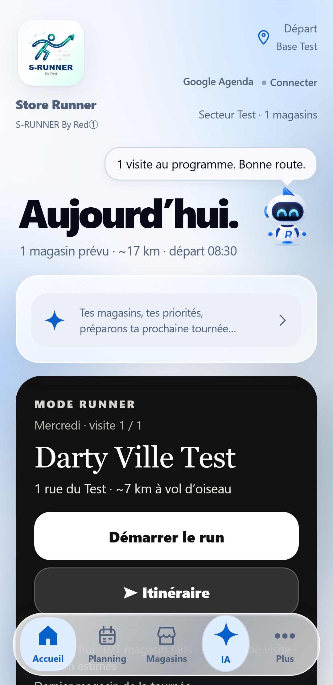
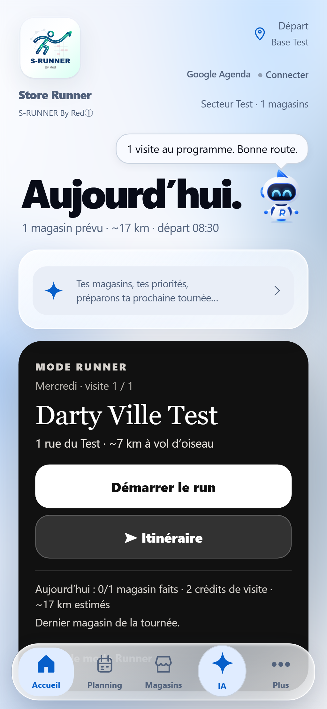
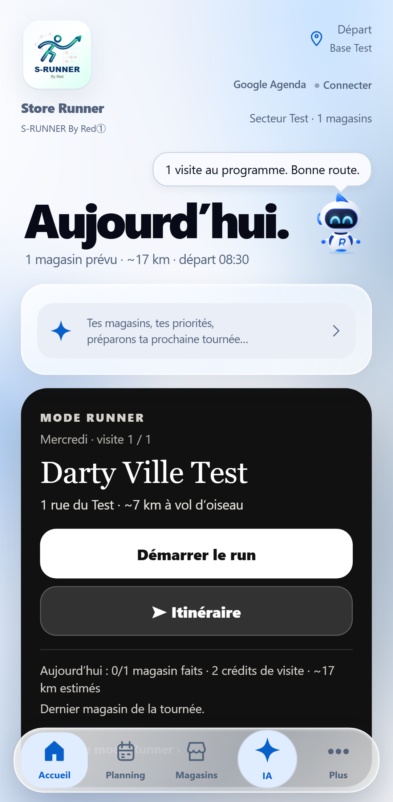
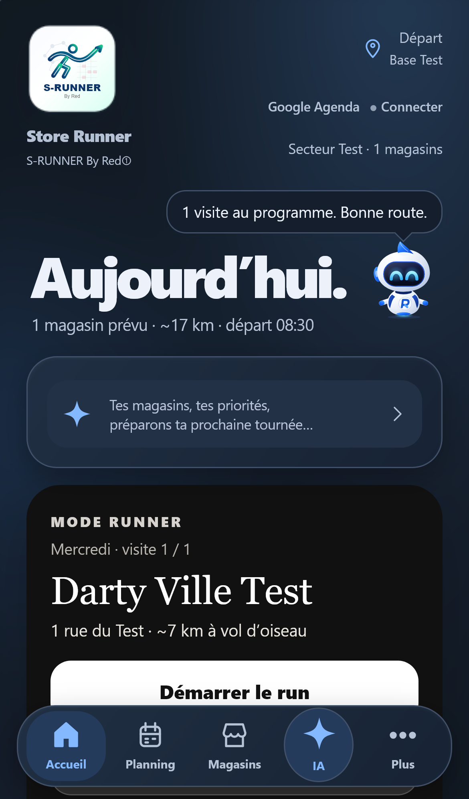

# Runner Accueil — micro-hotfix de la bulle

Base : main `de4ce0f55dd988d9bbb95e37b1846eadc8797b71`. Version 273 conservée ; build `20261006-r54-runner-bubble-273`.

Quatre captures de la vraie application servie par `tools/run-browser-tests.mjs`, avec données de recette et horloge fixée au mercredi 23 septembre 2026. Chaque contexte est neuf, avec Copilote par défaut : le texte est choisi par V273, sans message injecté ni réaction rejouée. La scène d’entrée est terminée avant la capture.

| Android 360 × 740, Chromium, clair | Android 390 × 844, Chromium, clair |
| --- | --- |
|  |  |

| Android 412 × 839, Chromium, clair | iPhone 14, 390 × 664, WebKit, sombre |
| --- | --- |
|  |  |

Contrôles : texte et titre sur une ligne dans ces captures, queue à 1 px du centre de Runner, aucun chevauchement avec le titre ni débordement horizontal, libellé sous la mascotte supprimé, bouton accessible et même feuille Apparence au toucher. Des contextes séparés vérifient deux lignes maximum avec des textes longs en clair/sombre et l’alignement avec le titre « Demain. » ; aucun texte de ces captures n’est forcé.

Ces captures ne remplacent pas la validation sur un iPhone physique. La PR reste en Draft ; aucune fusion avant la fin de #514 et un main vert.
